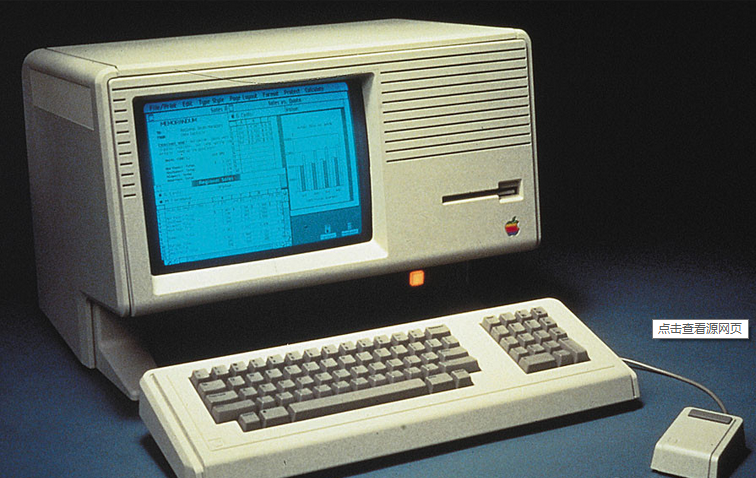
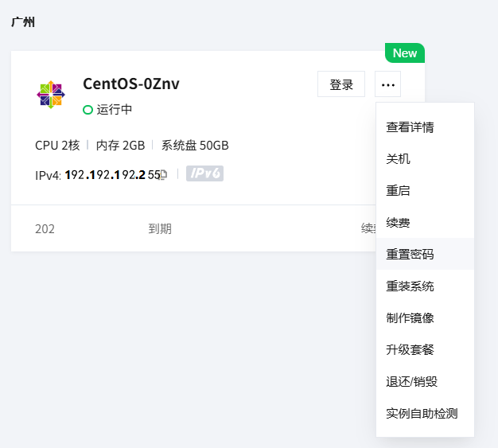

# Linux相关历史

Linux是操作系统（operator system，简称OS）的一种。

> 我们用的计算机是一堆硬件，这些硬件都要经历开机的过程才能正常使用计算机，开机加载的过程中就是OS在发挥作用。 
>
> OS是目前接触到的智能设备中最常见的软件，从电视到电脑都存在OS的影子。
>
> 人要通过OS去操作电脑，而平时 Linux OS 并没有直接让用户使用，如 Android 手机底层就是 Linux OS。Linux 目前主流的是一款服务器后端被选座位服务器的 OS 使用。

Linux的学习路线：

1. Linux 操作系统和在Linux上进行编程。
2. Linux OS 的网络以及相关编程。
3. Linux 中的 mySQL。

## 计算机历史和发展背景

1946年2月14日，第1台计算机 ANIAC 问世，主要用于计算导弹的弹道轨迹（即军事），当时人们谈的是创新和超越，各国需要大量人才发展科技去竞争，计算机便应运而生。

国家发展科技主要用于军事用途，发展科技要人、实验室、实验设备，这些都要钱。但科研始终有瓶颈，当科技在军事领域很成熟，已不再是很高的技术门槛，很多人都能开发，则美国人下一步行动：新兴技术商业化（即政府给钱）。

新兴技术商业化其实就是科技仅用于军事不赚钱，所以将科技产品卖给普通人来赚钱。

新兴技术商业化养活了各种各样的公司，政府从公司收税，而公司也需要老百姓加入或购买他们的产品。

> 这种模式还有一个专有名词：硅谷模式，指政府运作的逻辑。
>
> 硅谷模式大致原理（如下图，从政府开始，沿着黑色箭头理清思路，再沿着红色箭头逆向思考）：
>
> 

计算机就诞生与这样的背景时代。在硬件上便诞生了半导体与晶体管（摩尔定律等也在此时诞生）。同时伴随着新兴技术商业化，IBM、intel、苹果、微软等软、硬件公司就诞生了。


## 操作系统的概念

操作系统是对计算机的软、硬件做资源管理的软件，是最底层的软件。软件参考《软件工程》的概念：软件是计算机中的程序、数据和文档组成的集合。软件都是安装在操作系统上，所以做和软件相关的开发叫应用开发。


每一种硬件都需要配置有它的驱动程序，例如键盘、鼠标等。只有通过驱动，操作系统才能识别这些外部硬件。这些驱动只有纳入操作系统的管理系统下才能正常发挥作用，所以外部设备接入时会有1、2秒延迟是为了将硬件纳入操作系统的管理范围。

且访问过程是自顶向下的。

> c语言的`printf`看上去是将数据打印在黑色的对话框中，实际是将数据输出在显示器上，即硬件。所以c语言的程序直接访问了硬件。
>
> 其他的比如文件，文件的本质是读写磁盘。c语言的所有访问设备的操作都要访问操作系统，但因为做了封装，所以作为用户是感知不到的。

## 计算机的历史

计算机硬件上有摩尔定理等推动发展，体积也逐渐变小。为了使计算机更好操作，软件技术也在发展，在这基础上大神肯 · 汤姆森（Ken Tompson）用汇编写的 unix 操作系统。

计算机软件上传统汇编语言枯燥、易错，整体不是特别好用，于是C语言（Dennis Ritchie，丹尼斯 · 里奇）诞生。肯和丹尼斯合作用C重写 unix OS，之后该 OS 在各个准备商业化的计算机中运行。

随着硬件和软件的发展，搭载操作系统的计算机诞生，比起没搭载操作系统的计算机也变得更小。

之后有一家公司 IBM 为了计算机商业化，开始将很贵的计算机卖给政府、学校、公司。用的是企业使用的计算机。

后来又有一家公司苹果（软、硬件都做），在自身已研发出 IOS 系统的基础上，创始人乔布斯开始组织公司做桌面计算机（Personal Computer，个人计算机），也就有了第1款产品麦金塔（有基础的图形化界面）。麦金塔的界面如下：

虽然苹果的产品好，但价格贵，且为防技术泄漏，自己的生态做的比价好，便设门槛阻止人进入（例如打上苹果的 logo 即图标，操作系统用苹果的）。

同时另一个人，比尔 · 盖茨，和他的微软开始做软件。盖茨团队也就是微软开始做的是类似现在 windows OS 的控制台窗口（cmd）这种形式的操作系统，后来他们对自己的 OS 重新设计，并提出图形化界面，windows诞生。

微软在这一时期竞争不过乔布斯，于是微软和IBM开始合作，微软做软件，IBM做硬件。但IBM 单方面认为依旧无法降低计算机成本（买的人依旧是学校、政府和一些公司），而且微软认为 IBM 对企业计算机形成了垄断，所以断绝合作。

再后来微软 $+$ Intel 一直合作直到现在，他们的产品有 OS：windows，芯片：Intel。因为微软只做软件，Intel 只做芯片，为了更好发展，允许其他公司与自己合作（包括生产计算机硬件及其零件比如键盘、螺丝的公司）。

> windows版本：windowns 7，win 8，win 9，win 10， win 11。

就这样苹果和微软 $+$ Intel等2大巨头互相竞争争夺市场，其中诞生了很多例如笔记本电脑及各种电脑品牌（包括我国的）。


微软、Intel和与他们合作的电脑厂商，他们都只在自己擅长的领域工作，做出的东西成本较低，传播更为广泛，买的人也更多，他们于是压低利润争夺市场。这也是为什么现在绝大部分电脑都装的 windows （因为穷），这些电脑都是从乔布斯等人和盖茨等人竞争背景下的的个人电脑时代的历史遗留产物。

在双方斗的不亦乐乎时，1991年芬兰的赫尔辛基大学，一个研究生使用了携带有 Unix OS 的计算机，他认为 OS 是非常有利于使计算能机实现快速推进影响全世界的技术，但他没有话语权（蛋糕都被别的巨头分了），于是他用完别人的 OS 便开始写自己的小型 OS 并开源，同时将其命名为 Linux（取自 **L**inux **i**s **n**ot **U**ni**x**），这个学生就是雷纳斯 · 托瓦茨（Linus Torvalds）。

乔布斯团队开始和盖茨团队比较友好，但后来乔布斯团队认为盖茨团队偷了乔布斯团队的图形化界面的创意，盖茨团队也认为乔布斯团队看不起他们，也要甩同样的态度。但其实乔布斯也是先参观了施乐公司（一个做打印机的公司，他们有一块产品是在同样的界面操作，其实也就是炫耀技术，做出来后没看出商业价值就放在实验室），同时乔布斯也开始 ”痛恨“ 雷纳斯 · 托瓦茨，因为开源让他赚不到钱。

再后来一些黑客，以及看不惯收钱的人的顶级工程师，慢慢投身 Linux 系统，给 Linux 社区（社区即一起做的人拉起来的小团体、论坛等）共享代码。

说来说去，重要的就3个人：乔布斯、比尔 · 盖茨和雷纳斯 · 托瓦茨。乔布斯在软、硬件领域，比尔 · 盖茨在软件领域，雷纳斯 · 托瓦茨在开源领域都有作为。

其中开源还有一个重要的产物：在美国的一个公司的小团队，他们将 Linux 源码移植、裁剪到手机上，拿到了钱，但之后没钱没能力更新了，后被谷歌（Google）收购，然后给开源，又给这个新的操作系统取名 Android，故其底层也是 Linux。Google之所以开源是为与 iphone 竞争市场，否则容易出现苹果许可软件安装才能用的情况。

谷歌推出 Android 这款 OS 版本本意应是想开源给小白用，但有人想将 Linux 内核包装下给企业来用，所以有了 Linux 发行版，技术角度之一。

后全球手机厂商在 Android 的基础上开发自己的 OS。尤其是中国，中国尽管起步晚，但依托国内强大的工业，产业链相比全球其他国家更完善，使手机更普及。

OS 可以认为是人类写过的目前最大的软件（千万行级别），没有任何人能看完整，顶多专精某一领域和知道其他领域的作用和接口。


## 关于开源

开源即将 OS 源代码挂在网络上，随时随地所有人都可以来贡献源代码，且大部分都是免费的。

在20世纪末，能写 OS 的人是当时最顶级的工程师（行业顶尖的，现在也是），本身不差钱，其中一部分受使命感等原因（类似义工、志愿者）看到 OS 计数能改变世界的潜力，便将自己的能力投入 Linux，以 Linux 为核心使 Linux 发展到现在的规模。于是诞生了开源这个概念。

若利用开源的代码开发出新的东西（取开源的一部分），则新东西也要开源（大部分的开源许可证有要求）。

开源有一个好处：因为源代码公开，只要阅读的人足够多，问题就更容易被发现，但稳定性可能会产生问题（指不容易用着用着就关机蓝屏），效率也可能随之不稳定。

闭源一般是公司员工写的，或公司花钱买别人写的。但代码一旦出现问题，便会扯到责任问题，导致开发效率变慢，解决问题的周期变长，写代码的效率变低。若是一个人写的，则取决于一个人的主观意见和性格等，综合看来稳定性和效率不一定比开源好。

> 例如windons OS，一般当天开机当天关机，长时间开机回影响性能，可能会导致图形化界面卡成PPT。

论安全性闭源理应更好，因为无外人能看见源码，其他人包括黑客很难发现问题，但并不代表问题会消失，还会使问题往后不断延展，会存在安全隐患；但开源迟早会被人发现，所以实际却是开源的安全性会更好。

但开源也有问题：

1. 暴露问题会影响产品形象（品牌形象）。
2. 公司赚不到钱。
3. 用户不是大型服务器，不需要太长的运行时间和太好的质量，而是需要好用（即客户体验）。

> 曾经windows也有盗版横行，但也有可能微软故意放水，培养大部分人对windows产生习惯和依赖，使得电脑商不得不卖 windows OS的电脑，微软再向电脑厂商讨费用。

目前的OS除了 Linux 和 Android，大都是闭源。

## Linux源码下载和发行版本

综上所述，Linux是和windows、Android一样的操作系统。

点击进入[Linux官网](https://kernel.org/)，依次点击[ https://www.kernel.org/pub/](https://www.kernel.org/pub/)、linux、kernel（翻译过来就是内核），选择对应的版本，即可找到Linux的源码并下载。这几十 MB 甚至几百 MB 全是代码文本，内容有数千万行。


点击[ https://www.kernel.org/pub/](https://www.kernel.org/pub/)后跳转到如下页面。除了Linux内核，其他的都是Linux配套的软件。


之后点击 kernel ，这个是Linux的源码核心。


选择大版本。


选择小版本。


Linux发行版本示例（只看前3个数字）：主版本号.次版本号.修正次数。Linus开源后很多人在写，也有很多人在用。

例如 2.6.38.4.tar.gz，90 MB源码，2.6.38的38是偶数，表示是稳定版，而若是奇数则是测试版。2.6即为真正的版本号(一般范围是1.0`~`6，手机端是四点几）。

## Linux的选择

在Android的基础上，有人想将Linux OS 往电脑、往服务器上用，但 Linux 内核 只有 OS，无其他东西。例如windows用的（指用户直接接触的）是 OS 上的应用软件（例如QQ客户端），即仅用OS不够，还要有对应工具和软件。将这些工具打包，公司团队基于Linux 内核订制了商业发行版。

但无论神什么发行版本，只要用了 Linux 内核，就只有在使用接口（API）上的差别。

公司选 OS ，因用户是通过网络访问，大部分服务器只有网络输入输出，无键盘显示器，也无图形化界面，故应选稳定、效率、安全皆有保障且不要钱（或成本低）的OS。

所以工程师广泛使用Linux，未来入职也必定会Linux。

Linux商业发行版：例如Centos/红帽，Ubuntu，Kail，deban，红旗。它们都有属于自己的开源社区，组织和公司去维护。

红帽在 OS 的软件服务上收钱，给一些中、小企业提供软件解决方案和搭建环境，因为早期没有云服务给中、小企业建网络服务。现在有云服务器，红帽在尝试转型认证。

Ubuntu社区终点将图形化界面做的好，企业用Centos用的多，但其实可以随便选。

Linux应用场景：企业 99% 的服务器领域；手机领域；电视；智能家电；嵌入式领域；数据计算等。未来入网设备选用的OS如自动驾驶，无人机等。

> 关于鸿蒙OS：华为推出的OS，结合华为的设备强占未来市场，并不是取代Linux。推测鸿蒙内核可能也是Linux，因为他们为了用最少的钱强占时长，后期再替代Linux内核自己研发。
>
> 关于个人研发OS：主要看有没有人用，本质就是有没有钱，否则就是走过去美国走过的路。

# Linux安装

主要有2种方式：

1. 双系统，即windows和Linux一起装，开机时选择。不推荐，很容易出问题，出问题后很可能无法解决。

2. 虚拟机软件，搜 virtual box官网，进官网（oracle VM virtual Box），找到Downloud下载。
   或搜虚拟机VMware，也是进官网（但是收费），在产品中找到 VMware player（校园版，VMware workstation player），可使用免费的VMware work station player。装好后还要下一个虚拟机软件 Centos 7的镜像文件（搜清华大学Centos镜像，可在清华软件开源镜像中找Centos 7镜像文件（搜清华大学centOS），网址vmware.com.cn/products/workstation-player.html。

   不推荐，可能会安装不上，需要开CPU对应虚拟化技术，用到网络编程时会很麻烦。

3. 用别人的云服务器：阿里、腾讯、华为，可在网上使用，可选以学生身份购买。

   例如：搜腾讯云，找到官网，选登录。

   例如搜校园找到云 $+$ 校园，购买轻量应用服务器 2核2G，但要实名。

> 搜阿里云，找云服务器 ECS （也有其他），也有学生用的同名，也可白嫖使用。
>
> 还可以搜华为云……

假设在腾讯云买了轻量级服务器，在腾讯云，打开控制台（总览`->`控制台），找到已购服务器（例如centOS 7.6），点更多可关机、重启、安装等。

若还是想白嫖，假设有1人完成购买：

1. 下载本地登录软件 xshell（搜 xshell 校园版）并安装，链接[家庭/学校免费 - NetSarang Website](https://www.xshell.com/zh/free-for-home-school/)。

2. 在云服务器（买的），在网页后台，进行 root 密码重置（一定要做，
   点击更多 `->`重置密码）。

3. 开始登录，打开 xshell（初学不理会弹窗），要知道自己的公网IP，还要知道 Linux 刚开始只有1个用户 root 且重置过密码。在腾讯云买的一般写在选项卡右下角以
   （公）12.34.56 形式展示，表示公网。或者显示IPv4附近的公网IP。
   在 xshell 输入 `ssh root @公网IP`，后输入密码（切忌先重置密码）。

   直到弹出命令提示符`[root@一堆表示Linux服务器的信息 ~]#`，表示登录成功。

弹出这个表示还未登录。即`[C:\~]$`。出现这种情况，直接退出重进xshell即可。或输入上方命令弹出登录窗口。


若 xshell 出现 waring ，初期不用理会，因为用的 xshell 与终端不兼容但不影响使用。

Linux是一个多用户OS，允许多人登录。

登录 xshell ，在 Linux 中新建删除新用户，用 root 账号操作。

在 xshell（已登录服务器）。

加入：

输入 `adduser name` 添加用户。

` passwd name`修改密码。之后会弹出`new password:`。需要注意的是，它不回显密码。


输入`userdel -r name` 删除这个账户，


后面还有一句 `logout`感觉是登出。

之后即使用户输入密码也不给予登录。


# xshell安装和使用


许可协议内容：

```
NetSarang Computer License Agreement & Privacy Policy

This license agreement and privacy policy applies to the free version of NetSarang Computer Software and the tool used to install NetSarang Computer Software.

License Agreement
Carefully read the following terms and conditions before using this software. Your use of this software indicates your acceptance of this license agreement. No component part of any version of NetSarang Computer Software may be distributed individually, disassembled, copied, reverse engineered, or altered in any form.

Home/School Free Version
One free copy of NetSarang Computer Software may be used by a single person who uses the software on one desktop computer and one additional mobile device (e.g. laptop), which are both used exclusively by the licensed individual.

Home users are granted permission to install and use NetSarang Computer Software on computers at home using our Free License of NetSarang Computer Software. The installed Free License may only be used for personal non-commercial use. Any commercial use is prohibited. 

Students, professors, staff are granted permission to install and use NetSarang Computer Software on computers at school using our Free License of NetSarang Computer Software granted the school has been accredited by a valid verifiable source. If you are unsure whether your school qualifies, please contact our sales team at sales@netsarang.com. The installed Free License may only be used for educational purposes or to further the educational abilities of the school. 

University hospitals and research facilities/laboratories are not included in the Free Licensing Agreement. 

Tech support is not provided for Free Licenses.

The free license policy may be altered or revoked at any time without prior written notice.

Title and Copyright
The software (including any images, applets, photographs, animations, video, audio, music and text incorporated into the software) is owned by NetSarang Computer, Inc., or its suppliers and is protected by Korean copyright laws and international treaty provisions. Part of this software may have been developed by a third party software supplier, which holds copyright and other proprietary rights to the software.

This software is licensed to you. You are not obtaining title to the software or any copyrights. You may not sublicense, rent, or lease the software for any purpose. The license may be transferred (not resold) to another individual only if you keep no copies of the software.

Privacy Policy
NetSarang Computer, Inc. collects personal information that may be used to identify an individual during the use of our software. Personal information may include your email address, IP address, your UID, and license key/type. Any information we collect is used only to help generate leads, assist in marketing purposes,  or to confirm/enforce compliance with our licensing policies. We do not sell any information to any third party. Any information we collect may be combined with any other information we collect through either our website, publicly available databases, or through a third party. All information is stored on our servers and encrypted to prevent unauthorized access.

Disclaimer of Warranty
THIS SOFTWARE AND THE ACCOMPANYING FILES ARE PROVIDED "AS IS" AND WITHOUT WARRANTIES AS TO PERFORMANCE OR MERCHANTABILITY OR ANY OTHER WARRANTIES WHETHER EXPRESSED OR IMPLIED. Because of the various hardware and software environments into which NetSarang Computer Software  may be put, NO WARRANTY OF FITNESS FOR A PARTICULAR PURPOSE IS OFFERED.

Xmanager®, Xshell® are registered trademarks of NetSarang Computer, Inc.
Xftp™, Xlpd™ are trademarks of NetSarang Computer, Inc.
Copyright© 2024 NetSarang Computer, Inc. All rights reserved.

Yubico Copyright
NetSarang Computer Software utilizes Yubico's libfido2 library to facilitate communication with FIDO devices. Yubico requires that we provide you with the following notice:

Copyright (c) 2018-2024 Yubico AB. All rights reserved.

Redistribution and use in source and binary forms, with or without modification, are permitted provided that the following conditions are met:

   1. Redistributions of source code must retain the above copyright notice, this list of conditions and the following disclaimer.
   2. Redistributions in binary form must reproduce the above copyright notice, this list of conditions and the following disclaimer in the documentation and/or other materials provided with the distribution.

THIS SOFTWARE IS PROVIDED BY THE COPYRIGHT HOLDERS AND CONTRIBUTORS "AS IS" AND ANY EXPRESS OR IMPLIED WARRANTIES, INCLUDING, BUT NOT LIMITED TO, THE IMPLIED WARRANTIES OF MERCHANTABILITY AND FITNESS FOR A PARTICULAR PURPOSE ARE DISCLAIMED. IN NO EVENT SHALL THE COPYRIGHT HOLDER OR CONTRIBUTORS BE LIABLE FOR ANY DIRECT, INDIRECT, INCIDENTAL, SPECIAL, EXEMPLARY, OR CONSEQUENTIAL DAMAGES (INCLUDING, BUT NOT LIMITED TO, PROCUREMENT OF SUBSTITUTE GOODS OR SERVICES; LOSS OF USE, DATA, OR PROFITS; OR BUSINESS INTERRUPTION) HOWEVER CAUSED AND ON ANY THEORY OF LIABILITY, WHETHER IN CONTRACT, STRICT LIABILITY, OR TORT (INCLUDING NEGLIGENCE OR OTHERWISE) ARISING IN ANY WAY OUT OF THE USE OF THIS SOFTWARE, EVEN IF ADVISED OF THE POSSIBILITY OF SUCH DAMAGE.

```

剩下的就是安装中选择目录、应用快捷方式的选择位置。

再然后就是订购云服务器。


然后重置密码。



之后打开xshell。将公网或IPV4地址拷贝到这个框中。


弹出警告框


点击接受并保存，一路输入账号信息即可。


点击可以添加会话窗口。


之后再打开时可直接从弹窗打开。


