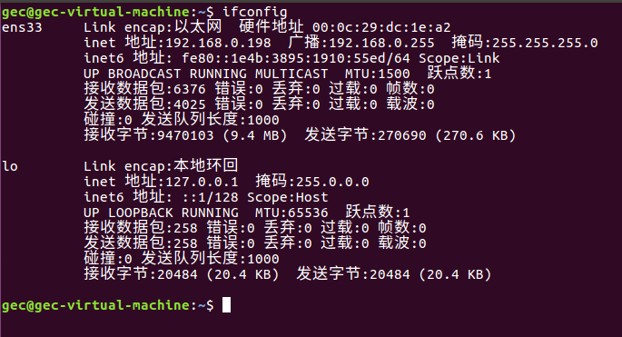
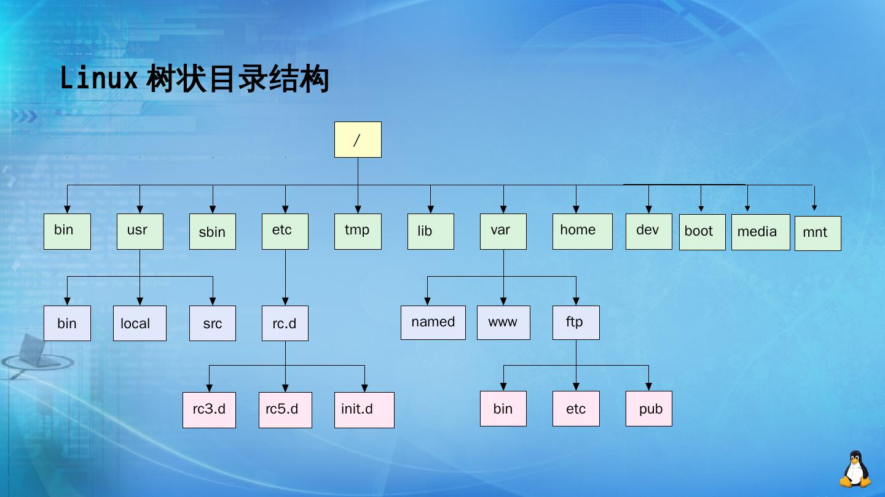
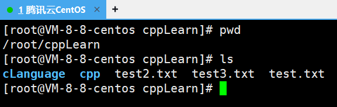
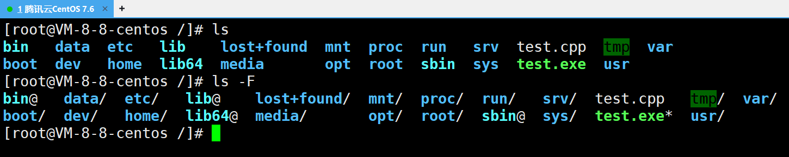
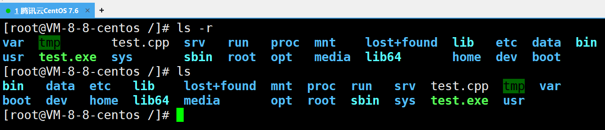
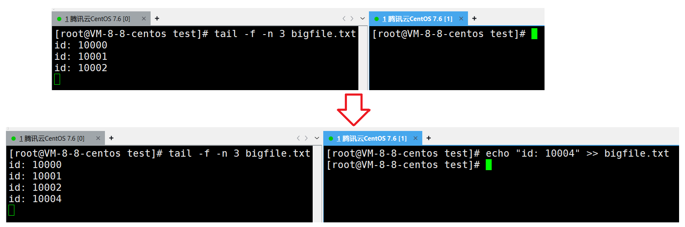
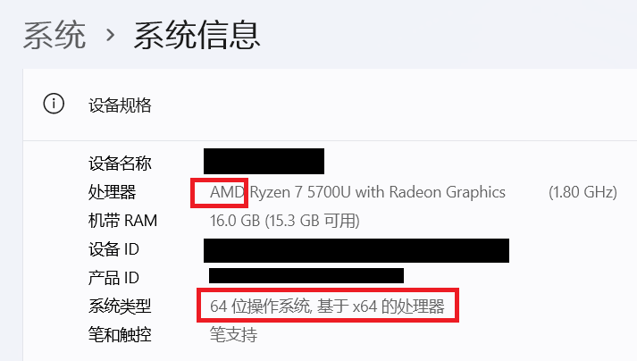

本篇术语： 

1. Windows（windows） 在不做特别提示的情况下泛指 Windows 操作系统。
2. Linux（linux） 在不做特别提示的情况下泛指 Linux 操作系统。
3. 指令和命令都是指同一个东西，都是用户给一个字符串，操作系统按照字符串的指示完成某一项工作。

操作系统几乎学不完，因为仅仅只是Linux，核心代码就有千万行，更不用说有很多操作系统。因此需要学习需要的，不懂的需要借助互联网和AI。

# shell命令以及运行原理

操作系统一般被划分为2个层级：

* 狭义上指内核（最核心的那一块），用于资源管理；
* 广义上指内核 $+$ 外壳 $+$ 对应的配套程序。

例如windows一般指内核和用户图形化界面（Graphical User Interface）等，windows没有图形化界面也能运行，尽管这样做对用户不算特别友好。

所以 Linux 也有“核心（kernel）“ ，但一般用户不能直接使用 kernel，而是通过 kernel 的“外壳”程序，也就是所谓的 shell（英语单词指外壳），来与 kernel 沟通。Shell 的最简单定义：**命令行解释器**（command Interpreter）。它主要包含：

* 将使用者的命令翻译给核心（kernel）处理。

* 同时，将核心的处理结果翻译给使用者。

类比 windows GUI，我们操作 windows 不是直接操作 windows 内核，而是通过**图形接口**，点击，从而完成我们的操作（比如进入D盘的操作，我们通常是双击 D 盘盘符，或者运行起来一个应用程序）。

shell 对于 Linux，有相同的作用，主要是**对用户的指令进行解析**，**解析指令传递给内核**。操作系统内核执行命令得到的反馈结果再通过内核运行出结果，再通过 shell 解析给用户。

shell 对于操作系统内核也有保护作用，会对非法指令（程序）和可能对内核造成伤害的指令进行拦截。

> 具体原理是shell会创建一个子进程，让子进程执行命令。而shell作为父进程，继续进行命令行的获取。
>
> 子进程出现了问题，不会影响父进程和OS内核的正常运行。

Linux 的 shell 程序叫做 bash。不同的操作系统的 shell 可能有不同的叫法。形象的说，shell 是所有命令行解释器的统称，具体的一款 shell 可能是 bash，sh或GUI等。

Linux是Android的底层操作系统，而Android是Linux的一个GUI或shell外壳。Android相当于是对Linux进行裁剪，使得Linux能移植到各种小型的移动设备。

> 虚拟机链接不上xshell：
>
> 在虚拟中输入`ifconfig`查找虚拟机的ip地址，再在windows的cmd终端，输入`ping ip`，能输出就能连接，否则就需要将虚拟机设置为桥接模式，再重启。
>
> Linux还可以建git仓库。


# XShell软件的相关命令和操作

**图形化界面**和**命令操作**本质都是进行对操作系统进行直接或间接的操作。

因为计算机的组件中先有键盘，才有鼠标。所以计算机刚开始时没有图形化界面，只有键盘，注定了早期的计算机只能通过指令操作。键盘的布局来源于打字机，经过很多人的打磨变成现在的布局。

> 这也是为什么以后的工作中没有机会使用图形界面。若想真正入行计算机，特别是后端开发，需要熟悉命令行操作。

其中 XShell （xshell）是远程连接云服务器的工具软件。XShell的常用操作：

1. 查看 Linux 主机 ip

在终端下敲 `ifconfig` 指令, 查看到 ip 地址。




2. 使用 XShell 登录主机

在 XShell 终端下敲`ssh [ip]`，`ip` 为刚才看到的 `ifconfig` 结果。如果网络畅通, 将会提示输入用户名密码。输入即可正确登陆。

3. XShell 下的复制粘贴

复制: <kbd>ctrl</kbd> + <kbd>insert</kbd> (部分电脑的 <kbd>insert</kbd> 需要配合 <kbd>Fn</kbd> 来按)。

粘贴: <kbd>shift</kbd> + <kbd>insert</kbd>。

windows常用的<kbd>ctrl</kbd> + <kbd>c</kbd> 在xshell常用于中断命令， <kbd>ctrl</kbd> + <kbd>v</kbd> 无默认功能，除非特别设定。

4. <kbd>Alt</kbd> + <kbd>Enter</kbd>打开全屏。反之关闭全屏。

即<kbd>Alt</kbd> +回车全屏。

5. <kbd>ctrl</kbd> + <kbd>r</kbd> 可以搜索指定的历史指令。之后按左、右键移动光标对指令细节进行修改即可。

# Linux的指令和热键

## 指令

`Linux`的指令本质也是操作系统下某个**可执行程序**，这个可执行程序由C语言、C++或其他语言或多种语言混合写的。

正因为是可执行程序，所以可通过给现有指令取别名（指令`alias`）、编写shell脚本（将已有的指令进行组合）、创建软链接、使用C语言、Python等自己设计指令并移植。因此具体有多少个指令没有一个统一的答案。

但也不需要学习完所有的指令，只需了解最核心、最常用的那一部分指令，即可学会使用操作系统。

每个指令可以输入<kbd>ctrl</kbd> + <kbd>c</kbd>表示不执行这个命令。

对每个命令，通常都会有语法、功能、常用选项和使用实例4个部分。使用实例会穿插在功能之后和每个常用选项之后。

对所有指令，我按照自己的理解，分成几个部分：

* 定位和转移目录用的指令。
* 文件操作相关的指令。
* 查看文件信息的指令。可执行程序也是文件。
* 时间有关的指令。
* 压缩、解压文件的指令。
* 特殊作用的指令。

## 热键

热键是输入指令的一部分，再按 Tab 可在历史指令中查找指定的指令。也可以只按Tab，但输出的是全部指令。这个热键有的版本的OS可能没有。

<kbd>ctrl</kbd>按键：具有 "命令补全" 和 "档案补齐" 的功能。

<kbd>ctrl</kbd> + <kbd>c</kbd>按键：让当前的程序 "停掉"，程序可以是指令造成的不可控程序或带死循环的程序。

<kbd>ctrl</kbd> + <kbd>d</kbd>按键：通常代表着： "键盘输入结束(End Of File, EOF 或 End Of Input)" 的意思；另外，他也可以用来取代`exit`。

# 定位和转移目录用的指令

## Linux的路径

在[树概念及结构-CSDN博客](https://blog.csdn.net/m0_73693552/article/details/143655251)中曾提到，在Linux系统中，磁盘上的文件和目录被组成一棵目录树（多叉树，子结点可以有很多个，但父结点只有1个），每个节点都是目录或文件，`/`即为根结点。




其中叶结点只有2种情况：空目录或非目录文件。

> 不是很形象的比喻，使用Linux操作系统，就像人在一个无比巨大的树上进行移动，目录就像树上的树洞，文件就像树洞里的书本、资料等。shell是这个树的守护者，它可以帮助人在树上做各种事，包括整理文件（资料）、创建目录（树洞）等。

Linux 一定会存在多个文件，找文件需要通过唯一的标识文件的方式，这个唯一的文件标识是路径。

路径分**绝对路径**和**相对路径**。绝对路径就是从根目录`/`到指定文件的所有路径，流入`/usr/bin/pwd`。相对路径是以当前目录为标识的其他文件的路径，一般以`.`或`..`开头。

`.`表示当前目录，`..`表示上级目录。其他的`.name`或`.test.txt`是隐藏目录或隐藏文件。通过`.`和`..`可以当前的目录为参考，移动到最近的目录。

> 这个操作就相当于某人在某个饭店吃饭，然后叫计程车时告诉司机自己要去的地方。这时说绝对路径比如中国某某省某某市某某区等等就不合适，直接说自己在哪个酒店就可以，因为自己和司机都在同一个城市的同一片辖区，司机不太可能找不到自己。

绝对路径一般在配置文件中写（例如 Windows OS 的环境变量），相对路径在 Linux OS 的操作中使用会更频繁。


## pwd指令

**语法**: `pwd` 

**功能**：显示用户当前所在的路径。

**举例**：

```bash
[root@VM-8-8-centos ~]# pwd
/root
[root@VM-8-8-centos ~]# 

```


## ls 指令和脚本

**语法**： `ls [选项][目录或文件]` 

**功能**：对于目录，该命令列出该目录下的所有子目录与文件。对于文件，将列出文件名以及其他信息。

### ls指令简单使用

只输入`ls`，会枚举该目录下的所有子目录名或者文件名。

```bash
[root@VM-8-8-centos cppLearn]# pwd
/root/cppLearn
[root@VM-8-8-centos cppLearn]# ls
cLanguage  cpp  test2.txt  test3.txt  test.txt
[root@VM-8-8-centos cppLearn]# 

```

在 xshell 中目录名和文件名会通过颜色高光来进行区分。在markdown文本可能无法显示这个高光，只能通过拓展名来区分文件和目录。




其中`/`称 Linux 下的分隔符，全称路径分隔符。Windows 也有，但不是`/` （斜杠，除法）而是`\`（反斜杠）。路径由目录名或文件名结合分隔符构成。

> Linux 继承了 Unix 的约定，Unix 使用 `/` 作为分隔符，因为这个符号醒目，且几乎不会用在文件名中。
>
> 而现代 windows 的命令行（如CMD、PowerShell）是为了兼容更早的 MS-DOS 系统，这个系统因为将 `/` 用作命令行的开关，所以用的就是 `\` 。

输入`ls /目录`可列举哪个目录下的所有目录和文件。

> 对应 Windows 的图形化界面的点击各种目录和文件的操作。

```bash
[root@VM-8-8-centos cppLearn]# pwd
/root/cppLearn
[root@VM-8-8-centos cppLearn]# ls /root
cppLearn  Other
[root@VM-8-8-centos cppLearn]# 

```

还可以直接输出指定路径下的可执行程序作为指令。

```bash
[root@VM-8-8-centos cLanguage]# ls
testC.c  test.exe
[root@VM-8-8-centos cLanguage]# /usr/bin/ls
testC.c  test.exe
[root@VM-8-8-centos cLanguage]# 
```

打开路径`/usr/bin/ls`可找到`ls`指令。其他指令也大都可以在这里找到。

```bash
[root@VM-8-8-centos cLanguage]# pwd
/root/cppLearn/cLanguage
[root@VM-8-8-centos cLanguage]# ls /usr/bin/ls
/usr/bin/ls
[root@VM-8-8-centos cLanguage]# ls /usr/bin/pwd
/usr/bin/pwd

```

输入`ls /usr/bin/*`可展开这个路径下的所有指令信息。因为内容太多，这里就不展示。


### ls指令常用选项

#### -a

`-a` 列出目录下的所有文件，包括以` .` 开头的隐含文件。

```bash
[root@VM-8-8-centos test]# ls -a
.  ..  .test.txt  test.txt
[root@VM-8-8-centos test]# ls
test.txt
[root@VM-8-8-centos test]# 
```


在 Linux 中，以 `.` **点开头的文件称之为隐藏文件**。例如这里的 `.test.txt`。

#### -d

`-d` 将目录像文件一样显示，而不是显示其下的文件。 如：`ls –d 指定目录`。
不给指定目录则输出 `.`，表示当前目录。

```bash
[root@VM-8-8-centos ~]# ls -d test
test
[root@VM-8-8-centos ~]# ls -d .
.
[root@VM-8-8-centos ~]# ls -d
.
[root@VM-8-8-centos ~]# 

```

#### -i

`-i` 输出文件的 `i` 节点的索引信息。 如 `ls –i 指定文件`

```bash
[root@VM-8-8-centos test]# ls -a
.  ..  .test.txt  test.txt
[root@VM-8-8-centos test]# ls -i test.txt
788288 test.txt
[root@VM-8-8-centos test]# ls -i
788288 test.txt
```

#### -k和脚本创造大文件

`-k`以 `k` (一千）字节的形式表示文件的大小。`ls –k 指定文件`。

例如这里通过脚本创造一个大文件，使用`ls -k`查看文件信息。

```bash
[root@VM-8-8-centos test]# ls -l
total 0
-rw-r--r-- 1 root root 0 Aug 27 21:42 bigfile.txt
[root@VM-8-8-centos test]# cnt=0; while [ $cnt -le 10000 ]; do echo "id: $cnt" >> bigfile.txt; let cnt++; done; 
[root@VM-8-8-centos test]# ls -l
total 88
-rw-r--r-- 1 root root 88900 Aug 27 21:43 bigfile.txt
[root@VM-8-8-centos test]# ls -s
total 88
88 bigfile.txt
[root@VM-8-8-centos test]# ls -s bigfile.txt
88 bigfile.txt
[root@VM-8-8-centos test]# 
```

其中循环10000次的脚本：

```bash
cnt=0; while [ $cnt -le 10000 ]; do echo "id: $cnt" >> bigfile.txt; let cnt++; done;
```

脚本的功能是打印字符串（可通过<kbd>ctrl</kbd>+C打断），同样可以通过输入重定向将内容打印到指定文件。

创造出来的这个文件的大小是 88900 byte，在这个 Linux 下一个块的大小是 4 KB（4096 字节），$88900\div 4096\approx 21.7$，因为文件系统不能分配半个块，所以必须**向上取整**，分配  22个块，换算成 1 KB 的块的数量是 88 KB。

#### -l

`-l`列出文件的详细信息。输入指令`ll`也能达到同样的效果，因为 Linux 可以取别名。这个指令可以查看文件的相关属性。

```bash
[root@VM-8-8-centos ~]# ls -l
total 8
drwxr-xr-x 2 root root 4096 Aug 14 13:44 cppLearn
drwxr-xr-x 2 root root 4096 Aug 14 13:44 Other
[root@VM-8-8-centos ~]# ll
total 8
drwxr-xr-x 2 root root 4096 Aug 14 13:44 cppLearn
drwxr-xr-x 2 root root 4096 Aug 14 13:44 Other

```

`ls -l -a`指令：`-a`即 all ，这个指令可以查看所有文件（包括隐藏的文件）。`ls -la`和`ls -al`也能达到同样的效果，因为 Linux 允许指令选项之间的符号相连。

```bash
[root@VM-8-8-centos cppLearn]# pwd
/root/cppLearn
[root@VM-8-8-centos cppLearn]# ls -l -a
total 16
drwxr-xr-x  4 root root 4096 Aug 14 13:57 .
dr-xr-x---. 8 root root 4096 Aug 14 13:44 ..
drwxr-xr-x  2 root root 4096 Aug 14 13:56 cLanguage
drwxr-xr-x  2 root root 4096 Aug 14 13:57 cpp
-rw-r--r--  1 root root    0 Aug 14 13:55 test2.txt
-rw-r--r--  1 root root    0 Aug 14 13:55 test3.txt
-rw-r--r--  1 root root    0 Aug 14 13:52 test.txt
[root@VM-8-8-centos cppLearn]# ls -la
total 16
drwxr-xr-x  4 root root 4096 Aug 14 13:57 .
dr-xr-x---. 8 root root 4096 Aug 14 13:44 ..
drwxr-xr-x  2 root root 4096 Aug 14 13:56 cLanguage
drwxr-xr-x  2 root root 4096 Aug 14 13:57 cpp
-rw-r--r--  1 root root    0 Aug 14 13:55 test2.txt
-rw-r--r--  1 root root    0 Aug 14 13:55 test3.txt
-rw-r--r--  1 root root    0 Aug 14 13:52 test.txt
[root@VM-8-8-centos cppLearn]# 

```

#### -n

`-n` 用数字的 UID,GID 代替名称。 （介绍 UID， GID）

```bash
[root@VM-8-8-centos test]# ls
bigfile.txt
[root@VM-8-8-centos test]# ls -l
total 88
-rw-r--r-- 1 root root 88900 Aug 27 21:43 bigfile.txt
[root@VM-8-8-centos test]# ls -n
total 88
-rw-r--r-- 1 0 0 88900 Aug 27 21:43 bigfile.txt
[root@VM-8-8-centos test]# 

```

UID即用户ID（User ID），GID即组ID（Group ID）。关于用户和组，详细见Linux权限，这里可以简单理解为文件的归属是某人、某个Linux认定的小组。

#### -F

`-F` 在每个文件名后附上一个字符以说明该文件的类型，`*` 表示可执行的普通文件；`/` 表示目录；`@` 表示符号链接；`|` 表示管道；`=` 表示套接字(sockets)。（目录类型识别）

注意只能是大写的F，小写的不会有效果。




#### -r

`-r` 对目录反向排序。




#### -t

`-t` 以时间排序。

```bash
[root@VM-8-8-centos /]# ls -tl
total 88
drwxrwxrwt.   8 root root  4096 Aug 27 22:38 tmp
-rwxr-xr-x    1 root root  8800 Aug 27 22:38 test.exe
dr-xr-x---.   7 root root  4096 Aug 27 22:38 root
-rw-r--r--    1 root root    67 Aug 27 22:38 test.cpp
dr-xr-xr-x   13 root root     0 Aug 27 01:43 sys
//...内容太多，这里省略
```

#### -s

`-s` 在文件名前输出该文件的大小。（大小排序，如何找到目录下最大的文件）

```bash
[root@VM-8-8-centos test]# ls
test.cpp  test.exe
[root@VM-8-8-centos test]# ls -s
total 16
 4 test.cpp  12 test.exe
[root@VM-8-8-centos test]# ls -s test.exe
12 test.exe
[root@VM-8-8-centos test]# 

```


#### -R

`-R` 以递归的方式列出所有子目录下的文件。

```bash
[root@VM-8-8-centos /]# ls -R test
test:
test.cpp  test.exe
[root@VM-8-8-centos /]# 

```

#### -1

`-1` 一行只输出一个文件。

```bash
[root@VM-8-8-centos test]# ls -1
dir1
test2.cpp
test.cpp
[root@VM-8-8-centos test]# ls
dir1  test2.cpp  test.cpp
[root@VM-8-8-centos test]# 

```


## cd 指令

可以通过`cd`指令跳转指定目录。

**语法**:`cd 目录名`

**功能**：改变工作目录。将当前工作目录改变到指定的目录下。

使用举例：

```bash
[root@VM-8-8-centos ~]# pwd
/root
[root@VM-8-8-centos ~]# ls
cppLearn  Other
[root@VM-8-8-centos ~]# cd cppLearn
[root@VM-8-8-centos cppLearn]# pwd
/root/cppLearn
[root@VM-8-8-centos cppLearn]# 

```

**举例**：

`cd ..` : 返回上级目录。

多个`..`可以用空格隔开（`cd .. .. ..`），但只会生效第1个。建议使用`/`分隔。

`cd /home/litao/linux/` : 跳转到绝对路径。
`cd ../day02/` : 跳转到相对路径。
`cd ~`：进入用户家目。例如管理员用户`root` 则会进入`\root`，而普通用户会进入 `\home\username`。可输入`whoami`查看当前正在使用系统的用户的账号名。

> 若是 Windows OS，可通过图形化界面的文件管理器找到用户，可查看使用本设备的账号。

`cd -`：返回最近访问目录

```bash
[root@VM-8-8-centos cLanguage]# cd ~
[root@VM-8-8-centos ~]# cd -
/root/cppLearn/cLanguage
[root@VM-8-8-centos cLanguage]# 

```

`cd /`：进入根目录。


## tree和whoami指令

`tree`指令表示把以某个目录为根结点的文件的树状结构显示出来。`tree`需要先安装，若是`root`账号，则需要使用 root 账户输出`yum install install -y`进行安装。

```bash
[root@VM-8-8-centos cppLearn]# ls
cLanguage  cpp  p1
[root@VM-8-8-centos cppLearn]# tree cLanguage
cLanguage
|-- testC.c
`-- test.exe

0 directories, 2 files
[root@VM-8-8-centos cppLearn]# tree ..
..
|-- cppLearn
|   |-- cLanguage
|   |   |-- testC.c
|   |   `-- test.exe
|   |-- cpp
|   `-- p1
|       `-- p2
|           `-- pe
`-- Other

7 directories, 2 files
[root@VM-8-8-centos cppLearn]# tree p1
p1
`-- p2
    `-- pe

2 directories, 0 files
[root@VM-8-8-centos cppLearn]# 

```

若是普通账户，则要切换成`root`账户，再进行安装。例如这里普通用户 Bjarne 切换成 root 账户。使用`whoami`可查看当前账户的ID。

```bash
[Bjarne@VM-8-8-centos ~]$ whoami
Bjarne
[Bjarne@VM-8-8-centos ~]$ su # 切换账户
Password: 
su: Authentication failure #这是因为输入的密码非root账号的密码
[Bjarne@VM-8-8-centos ~]$ whoami
Bjarne
[Bjarne@VM-8-8-centos ~]$ su
Password: # 输入正确的root密码
[root@VM-8-8-centos Bjarne]# whoami
root
[root@VM-8-8-centos Bjarne]# 
```

切换完成后可以选择退出`root`账户。

````bash
[Bjarne@VM-8-8-centos ~]$ su
Password: 
[root@VM-8-8-centos Bjarne]# whoami
root
[root@VM-8-8-centos Bjarne]# exit
exit
[Bjarne@VM-8-8-centos ~]$ 

````

# 文件操作相关的指令

## touch和stat指令

**语法**:`touch [选项]... 文件...` 

**功能**：`touch`命令参数可更改文档或目录的日期时间，包括存取时间和更改时间，或者新建一个不存在的文件。

### touch简单使用

一个文件有名字、日期、大小、修改日期、权限等信息，所以只创建一个空文件但什么也不做，在磁盘上也占据空间。即在计算机中，`文件 = 内容 + 属性`。

对文件的操作分为**对内容的操作**和**对属性的操作**。

例如创建文件：

```bash
[root@VM-8-8-centos cppLearn]# pwd
/root/cppLearn
[root@VM-8-8-centos cppLearn]# touch test.txt
[root@VM-8-8-centos cppLearn]# ll
total 0
-rw-r--r-- 1 root root 0 Aug 14 13:52 test.txt
[root@VM-8-8-centos cppLearn]# ls
test.txt
[root@VM-8-8-centos cppLearn]# 

```

可以同时创建多个文件。

```bash
[root@VM-8-8-centos cppLearn]# pwd
/root/cppLearn
[root@VM-8-8-centos cppLearn]# ls
test.txt
[root@VM-8-8-centos cppLearn]# touch test2.txt test3.txt
[root@VM-8-8-centos cppLearn]# ls
test2.txt  test3.txt  test.txt
[root@VM-8-8-centos cppLearn]# 

```

也可以创建隐藏文件。例如这里创建`.R18.txt`存放不可描述的文本。

```bash
[root@VM-8-8-centos cppLearn]# pwd
/root/cppLearn
[root@VM-8-8-centos cppLearn]# ls -a
.  ..  cLanguage  cpp  test2.txt  test3.txt  test.txt
[root@VM-8-8-centos cppLearn]# touch .R18.txt
[root@VM-8-8-centos cppLearn]# ls -a
.  ..  cLanguage  cpp  .R18.txt  test2.txt  test3.txt  test.txt
[root@VM-8-8-centos cppLearn]# ls
cLanguage  cpp  test2.txt  test3.txt  test.txt
[root@VM-8-8-centos cppLearn]# 

```

若文件存在，则更新文件的时间信息。

```bash
[root@VM-8-8-centos test]# ls
test.cpp  test.exe
[root@VM-8-8-centos test]# ll
total 16
-rw-r--r-- 1 root root   67 Aug 27 22:38 test.cpp
-rwxr-xr-x 1 root root 8800 Aug 27 22:42 test.exe
[root@VM-8-8-centos test]# touch test.cpp
[root@VM-8-8-centos test]# ll
total 16
-rw-r--r-- 1 root root   67 Aug 27 23:17 test.cpp
-rwxr-xr-x 1 root root 8800 Aug 27 22:42 test.exe
[root@VM-8-8-centos test]# 
```


### touch常用选项和stat指令

#### -a和stat指令

`-a`  或`--time=atime`或`--time=access`或`--time=use`只更改存取时间。

获取获取时间的指令：`stat 文件名`。

```bash
[root@VM-8-8-centos cLanguage]# ls
testC.c  test.exe
[root@VM-8-8-centos cLanguage]# stat testC.c
  File: ‘testC.c’
  Size: 72        	Blocks: 8          IO Block: 4096   regular file
Device: fd01h/64769d	Inode: 656350      Links: 1
Access: (0644/-rw-r--r--)  Uid: (    0/    root)   Gid: (    0/    root)
Access: 2025-08-14 14:39:15.376259779 +0800
Modify: 2025-08-14 14:39:14.122224784 +0800
Change: 2025-08-14 14:39:14.130225008 +0800
 Birth: -
[root@VM-8-8-centos cLanguage]# 

```

在Linux，一个文件伴随3个重要的时间：

* `Access`：访问时间（文件最后一次被访问的时间）。
* `Modify`：文件**内容**最后一次被更改的时间。
* `Change`，文件的**元数据**（如权限、所有者等）最后一次被改变的时间。

使用选项`-a`修改时间：

```bash
[root@VM-8-8-centos test]# ls
test.cpp  test.exe
[root@VM-8-8-centos test]# stat test.cpp
# ...
Access: 2025-08-27 23:17:55.749134162 +0800   # 改变之前
Modify: 2025-08-27 23:17:55.749134162 +0800
Change: 2025-08-27 23:17:55.749134162 +0800   # 改变之前
# ...
[root@VM-8-8-centos test]# touch -a test.cpp
[root@VM-8-8-centos test]# stat test.cpp
# ...
Access: 2025-08-27 23:24:11.962039020 +0800   # 改变之后
Modify: 2025-08-27 23:17:55.749134162 +0800
Change: 2025-08-27 23:24:11.962039020 +0800   # 改变之前
# ...
[root@VM-8-8-centos test]# 

```

等效的选项：`--time=atime`或`--time=access`或`--time=use`，它们只更改`Access`和`Change` 2个时间。

```bash
[root@VM-8-8-centos test]# ls
test.cpp  test.exe
[root@VM-8-8-centos test]# stat test.cpp
# 省略不重要的信息
Access: 2025-08-27 23:29:00.353499370 +0800 # 改变前
Modify: 2025-08-27 23:17:55.749134162 +0800
Change: 2025-08-27 23:29:00.353499370 +0800 # 改变前
# 省略不重要的信息
[root@VM-8-8-centos test]# touch --time=atime test.cpp
[root@VM-8-8-centos test]# stat test.cpp
# 省略不重要的信息
Access: 2025-08-27 23:29:58.196792291 +0800 # 改变后
Modify: 2025-08-27 23:17:55.749134162 +0800
Change: 2025-08-27 23:29:58.196792291 +0800 # 改变后
# 省略不重要的信息
[root@VM-8-8-centos test]# 

```


#### -c

`-c`  或`--no-create` 不建立任何文档。

`touch`在没有使用`-c`时，对存在的文件会更新时间，对不存在的文件会创建文件。

而使用了`-c`选项后，对存在的文件同样会更新时间，但**对不存在的文件不会创建文件**。

```bash
[root@VM-8-8-centos test]# ls
test.cpp
[root@VM-8-8-centos test]# touch -c xxx.cpp
[root@VM-8-8-centos test]# ls
test.cpp
[root@VM-8-8-centos test]# 

```

#### -d

`-d`使用指定的日期时间，而非现在的时间。

设置绝对时间：

```bash
[root@VM-8-8-centos test]# stat bigfile.txt
# 这里隐藏部分无关信息
Modify: 2025-08-27 21:43:25.815635740 +0800
[root@VM-8-8-centos test]# touch -d "2024-06-06 11:45:14" bigfile.txt
[root@VM-8-8-centos test]# stat bigfile.txt
# ...
Modify: 2024-06-06 11:45:14.000000000 +0800
# ...
[root@VM-8-8-centos test]# 
```

绝对时间可以是英文的：

```bash
touch -d "27 August 2025 2:30:45 PM" bigfile.txt # 英文描述同样有效
touch -d "Aug 27 14:30:45 CST 2025" bigfile.txt  # 指定CST(UTC+8)时间
```

设置相对时间：

```bash
# 设置为 2天前
touch -d "2 days ago" bigfile.txt

# 设置为 1小时后
touch -d "1 hour" bigfile.txt

# 设置为 下周二
touch -d "next Tuesday" bigfile.txt

# 设置为 上周日
touch -d "last Sunday" bigfile.txt

# 设置为 今年元旦
touch -d "Jan 1" bigfile.txt

# 组合使用：设置为 “明天下午3点”
touch -d "tomorrow 15:00" bigfile.txt

# 设置为 “30秒前”
touch -d "30 seconds ago" bigfile.txt
```

使用其他命令的输出作为时间：

```bash
[root@VM-8-8-centos test]# ls
bigfile.txt
[root@VM-8-8-centos test]# stat bigfile.txt
# ...
Access: 2025-08-28 12:26:34.373661730 +0800
Modify: 2024-06-06 11:45:14.000000000 +0800
Change: 2025-08-28 12:26:34.091660357 +0800
# ...
[root@VM-8-8-centos test]# touch test.txt
[root@VM-8-8-centos test]# stat test.txt
# ...
Access: 2025-08-28 12:37:59.141990544 +0800
Modify: 2025-08-28 12:37:59.141990544 +0800
Change: 2025-08-28 12:37:59.141990544 +0800
# ...
[root@VM-8-8-centos test]# touch -d "$(date -r bigfile.txt)" test.txt
[root@VM-8-8-centos test]# stat test.txt
# ...
Access: 2024-06-06 11:45:14.000000000 +0800
Modify: 2024-06-06 11:45:14.000000000 +0800
Change: 2025-08-28 12:38:17.563080048 +0800
# ...
[root@VM-8-8-centos test]# 

```

也可结合`-a`，只更新时间戳。

```bash
[root@VM-8-8-centos test]# stat test.txt
# ...
Access: 2024-06-06 11:45:14.000000000 +0800
Modify: 2024-06-06 11:45:14.000000000 +0800
Change: 2025-08-28 12:38:17.563080048 +0800
# ...
[root@VM-8-8-centos test]# touch -a -d "yesterday" test.txt
[root@VM-8-8-centos test]# stat test.txt
# ...
Access: 2025-08-27 12:42:15.769875871 +0800
Modify: 2024-06-06 11:45:14.000000000 +0800
Change: 2025-08-28 12:42:15.769237241 +0800
# ...
[root@VM-8-8-centos test]# 

```

#### -f 被忽视的选项

`-f` 此参数将忽略不予处理，仅负责解决 BSD 版本 `touch` 指令的兼容性问题。

在早期某些 Unix 系统（如旧版本的 BSD，即 Berkeley Software Distribution，伯克利软件发行版）的 `touch` 实现中，可能定义了 `-f` 选项用于某种功能。为了确保为那些旧系统编写的脚本在新系统（如 GNU/Linux）上运行时不会因为遇到不认识的 `-f` 选项而报错，GNU 实现选择接受这个选项但忽略它（不执行任何操作），从而保证脚本能继续运行。

所以`-f`就是用来占位的，防止早期的指令及其代码移植到现在的系统因不能用而报错。

可通过`touch --help`查看指令信息，可看到`-f`是 ignored（忽视）。

```bash
[root@VM-8-8-centos test]# touch --help
Usage: touch [OPTION]... FILE...
Update the access and modification times of each FILE to the current time.

A FILE argument that does not exist is created empty, unless -c or -h
is supplied.

A FILE argument string of - is handled specially and causes touch to
change the times of the file associated with standard output.

Mandatory arguments to long options are mandatory for short options too.
# 省略
  -f                     (ignored)
# 省略
```


#### -m

`-m`  或`--time=mtime`或`--time=modify` 只更改变动时间（修改时间，即Modify）。

```bash
[root@VM-8-8-centos test]# stat test.txt
# ...
Access: 2025-08-27 12:42:15.769875871 +0800
Modify: 2024-06-06 11:45:14.000000000 +0800
Change: 2025-08-28 12:42:15.769237241 +0800
# ...
[root@VM-8-8-centos test]# touch -m test.txt
[root@VM-8-8-centos test]# stat test.txt
# ...
Access: 2025-08-27 12:42:15.769875871 +0800
Modify: 2025-08-28 13:56:44.764166826 +0800
Change: 2025-08-28 13:56:44.764166826 +0800
# ...
[root@VM-8-8-centos test]# 

```

与`-a`对应，`-a`只修改访问时间。

#### -r

`-r` 把指定文档或目录的日期时间，都设成和参考文档或目录的日期时间相同。

格式：`touch -r 参考文件 目标文件`。

```bash
[root@VM-8-8-centos test]# stat bigfile.txt
# ...
Access: 2025-08-28 12:26:34.373661730 +0800
Modify: 2024-06-06 11:45:14.000000000 +0800
Change: 2025-08-28 12:26:34.091660357 +0800
# ...
[root@VM-8-8-centos test]# stat test.txt
# ...
Access: 2025-08-27 12:42:15.769875871 +0800
Modify: 2025-08-28 13:56:44.764166826 +0800
Change: 2025-08-28 13:56:44.764166826 +0800
# ...
[root@VM-8-8-centos test]# touch -r test.txt bigfile.txt
[root@VM-8-8-centos test]# stat bigfile.txt
# ...
Access: 2025-08-28 14:00:07.377165430 +0800
Modify: 2025-08-28 13:56:44.764166826 +0800
Change: 2025-08-28 14:00:06.287160060 +0800
# ...
[root@VM-8-8-centos test]# 

```

也可以使用长选项格式：

```bash
touch --reference=参考文件 目标文件
```

#### -t

`-t` 使用指定的日期时间，而非现在的时间。选项后面必须跟一个特定格式的时间戳参数。

格式：`touch -t [[CC]YY]MMDDhhmm[.ss] 文件名`，例如`199312260815.13`表示1993年12月26日8点15分13秒。其中表示世纪的`CC`和表示年份的`YY`，还有表示秒的`ss`可省略，`CC`和`YY`省略后用当前年份，`SS`省略后用0表示。

```bash
[root@VM-8-8-centos test]# stat test.txt
# ...
Access: 2025-08-27 12:42:15.769875871 +0800
Modify: 2025-08-28 14:04:17.437396673 +0800
Change: 2025-08-28 14:04:17.437396673 +0800
# ...
[root@VM-8-8-centos test]# touch -t 199312260815.13 test.txt
[root@VM-8-8-centos test]# stat test.txt
# ...
Access: 1993-12-26 08:15:13.000000000 +0800
Modify: 1993-12-26 08:15:13.000000000 +0800
Change: 2025-08-28 14:07:57.797480629 +0800
# ...
[root@VM-8-8-centos test]# 

```


## mkdir指令（重要）

**语法**：`mkdir [选项] dirname...`

**功能**：在当前目录下创建一个名为 `dirname` 的目录。

例如，创建一个 Other 目录。

```bash
[root@VM-8-8-centos ~]# ls
cppLearn
[root@VM-8-8-centos ~]# mkdir Other
[root@VM-8-8-centos ~]# ls
cppLearn  Other

```

`mkdir`只能创建空目录，不能创建带路径的目录。


**常用选项**：

`-p`, `--parents` 表示可以是一个路径名称。此时若路径中的某些目录尚不存在,加上此选项后，系统将自动建立好那些尚不存在的目录，即一次可以建立多个目录。

举例：递归建立多个目录。

```bash
[root@VM-8-8-centos ~]# ls
[root@VM-8-8-centos ~]# mkdir -p test1/test2
[root@VM-8-8-centos ~]# tree .
.
`-- test1
    `-- test2

2 directories, 0 files
[root@VM-8-8-centos ~]# 

```


## rm和rmdir指令

### rmdir指令

`rmdir`是一个与`mkdir`相对应的命令。`mkdir`是建立目录，而`rmdir`是删除命令。

**语法**：`rmdir [-p][dirName]` 

**适用对象**：具有当前目录操作权限的所有使用者。

**功能**：删除空目录。但无法删除文件。`root`账户删除会提示，普通账户不会提示。

```bash
[root@VM-8-8-centos cLanguage]# pwd
/root/cppLearn/cLanguage
[root@VM-8-8-centos cLanguage]# tree .
.
|-- dir
|-- no_empty_dir
|   `-- test.txt
|-- testC.c
`-- test.exe

2 directories, 3 files
[root@VM-8-8-centos cLanguage]# rmdir no_empty_dir
rmdir: failed to remove ‘no_empty_dir’: Directory not empty
[root@VM-8-8-centos cLanguage]# rmdir test.exe
rmdir: failed to remove ‘test.exe’: Not a directory
[root@VM-8-8-centos cLanguage]# rmdir dir
[root@VM-8-8-centos cLanguage]# tree .
.
|-- no_empty_dir
|   `-- test.txt
|-- testC.c
`-- test.exe

1 directory, 3 files
[root@VM-8-8-centos cLanguage]# 
```


**常用选项**：

`-p` 当子目录被删除后如果父目录也变成空目录的话，就连带父目录一起删除。

`rm`命令可以同时删除文件或目录，比`rmdir`指令好用，平时更多的也是用`rm`。

### rm 指令（重要）

**语法**：`rm [-f-i-r-v][dirName/dir]` 

**适用对象**：所有使用者

**功能**：删除文件或目录

**常用选项**：

#### -f

`-f` 即使文件属性为只读(即写保护)，也要直接删除，不会提示。

```bash
[root@VM-8-8-centos test]# ls
t1.txt  t2.txt
[root@VM-8-8-centos test]# rm t1.txt
rm: remove regular empty file ‘t1.txt’? y
[root@VM-8-8-centos test]# rm -f t2.txt
[root@VM-8-8-centos test]# ls
[root@VM-8-8-centos test]# 

```

#### -i

`-i` 删除前逐一询问确认。

```bash
[root@VM-8-8-centos test]# ls
t1.txt  t2.txt
[root@VM-8-8-centos test]# rm -i t1.txt t2.txt
rm: remove regular empty file ‘t1.txt’? y
rm: remove regular empty file ‘t2.txt’? n
[root@VM-8-8-centos test]# ls
t2.txt
[root@VM-8-8-centos test]# 

```

#### -r

`-r` （递归）删除目录及其下所有文件。

```bash
[root@VM-8-8-centos ~]# tree .
.
`-- test
    `-- t2.txt

1 directory, 1 file
[root@VM-8-8-centos ~]# rm -r test
rm: descend into directory ‘test’? y
rm: remove regular empty file ‘test/t2.txt’? y
rm: remove directory ‘test’? y
[root@VM-8-8-centos ~]# tree .
.

0 directories, 0 files
[root@VM-8-8-centos ~]# 
```

`rm -rf ./*` 或 `rm -rf *`可删除当前目录的所有文件和目录（包括隐藏的目录）。

```bash
[root@VM-8-8-centos cLanguage]# ls
testC.c  test.exe
[root@VM-8-8-centos cLanguage]# rm -rf ./* # 可更换成rm -rf *
[root@VM-8-8-centos cLanguage]# ls
[root@VM-8-8-centos cLanguage]# 
```

若是 root 账户，一般会提示，想怎么删就怎么删；若是普通账户，则只能删自己的目录，无法进入别人的目录，还不一定有提示。例如普通用户 Bjarne，在CentOS 7.6就没有提示。

```bash
[Bjarne@VM-8-8-centos ~]$ tree .
.
`-- cppTest
    `-- Bjarne.cpp

1 directory, 1 file
[Bjarne@VM-8-8-centos ~]$ rm -r cppTest
[Bjarne@VM-8-8-centos ~]$ tree .
.

0 directories, 0 files
[Bjarne@VM-8-8-centos ~]$ 
```


## cp、alias和unalias指令（重要）

**语法**：`cp [选项] 源文件或目录 目标文件或目录`

**功能**: 复制文件或目录。

### cp指令简单使用

**说明**: `cp`指令用于复制文件或目录，如同时指定两个以上的文件或目录，且最后的目的地是一个已经存在的目录，则它会把前面指定的所有文件或目录复制到此目录中。若同时指定多个文件或目录，而最后的目的地并非一个已存在的目录，则会出现错误信息。

```bash
[root@VM-8-8-centos cLanguage]# tree /root/cppLearn
/root/cppLearn
|-- cLanguage
|   |-- test.c
|   `-- test.exe
`-- cpp

2 directories, 2 files
[root@VM-8-8-centos cLanguage]# cp test.c ../cpp
[root@VM-8-8-centos cLanguage]# tree /root/cppLearn
/root/cppLearn
|-- cLanguage
|   |-- test.c
|   `-- test.exe
`-- cpp
    `-- test.c

2 directories, 3 files
[root@VM-8-8-centos cLanguage]# 

```

也可以拷贝并更改名字。

```bash
[root@VM-8-8-centos cpp]# ls
test.c
[root@VM-8-8-centos cpp]# cp test.c test.cpp
[root@VM-8-8-centos cpp]# ls
test.c  test.cpp
[root@VM-8-8-centos cpp]# 
```


### cp指令常用选项和alias指令

#### -f选项

`-f` 或 `--force` 强行复制文件或目录， 无论目的文件或目录是否已经存在。

但要注意，部分 Linux 发行版为了防止用户意外覆盖文件，默认会为 `cp`、`mv`、`rm` 等危险命令创建别名。

```bash
[root@VM-8-8-centos test]# alias cp
alias cp='cp -i'
[root@VM-8-8-centos test]# 

```

要绕过这个别名，可使用`\`：

```bash
[root@VM-8-8-centos test]# cp -f test.txt test2.txt
cp: overwrite ‘test2.txt’? y
[root@VM-8-8-centos test]# \cp -f test.txt test2.txt
[root@VM-8-8-centos test]# 

```

#### alias和unalias指令

`alias ll='ls -l --color=auto'`表示`ll`是`ls -l --color=auto`的别名。这里的`cp`就是因为使用了`alias`重命名，使得 `cp` 默认自带 `-i` 选项。

可以用`alias`给指令取别名。

```bash
[root@VM-8-8-centos cLanguage]# which pwd
/usr/bin/pwd
[root@VM-8-8-centos cLanguage]# which ll
alias ll='ls -l --color=auto'
	/usr/bin/ls
[root@VM-8-8-centos cLanguage]# alias read='ls -a'
[root@VM-8-8-centos cLanguage]# read
.  ..  testC.c  test.exe
[root@VM-8-8-centos cLanguage]# 

```

直接输入`alias`可查看所有的别名。也可以通过`unalias 指令别名`删除别名。

```bash
[root@VM-8-8-centos test]# alias xxx='ls -a'
[root@VM-8-8-centos test]# xxx # 随便创建一个指令
.  ..  dir1  test2.cpp  test.cpp
[root@VM-8-8-centos test]# alias
# 省略一大堆指令别名
alias xxx='ls -a'
[root@VM-8-8-centos test]# unalias xxx # 移除指令
[root@VM-8-8-centos test]# xxx
-bash: xxx: command not found # 他说指令没找到，因为刚才已经删了
[root@VM-8-8-centos test]# 
```

#### -i

`-i` 或 `--interactive` 覆盖文件之前先询问用户。

```bash
[root@VM-8-8-centos ~]# tree .
.
|-- test
|   |-- test2.txt
|   `-- test.txt
`-- test2
    `-- test
        |-- test2.txt
        `-- test.txt

3 directories, 4 files
[root@VM-8-8-centos ~]# cp -r -i test test2
cp: overwrite ‘test2/test/test.txt’? y
cp: overwrite ‘test2/test/test2.txt’? n
[root@VM-8-8-centos ~]# 
```

#### -r和-R

`-r` 递归处理，将指定目录下的文件与子目录一并处理。若源文件或目录的形态，不属于目录或符号链接，则一律视为普通文件处理。目录和该目录的子目录构成书上结构，需要加`-r`表示递归操作。`-r`可以放前面，可以放后面。

```bash
[root@VM-8-8-centos cLanguage]# pwd
/root/cppLearn/cLanguage
[root@VM-8-8-centos cLanguage]# tree ..
..
|-- cLanguage
|   |-- test.c
|   `-- test.exe
`-- cpp

2 directories, 2 files
[root@VM-8-8-centos cLanguage]# cp -r ../cLanguage ../cpp
[root@VM-8-8-centos cLanguage]# tree ..
..
|-- cLanguage
|   |-- test.c
|   `-- test.exe
`-- cpp
    `-- cLanguage
        |-- test.c
        `-- test.exe

3 directories, 4 files
[root@VM-8-8-centos cLanguage]# 

```

`-R` 或 `--recursive`递归处理，将指定目录下的文件及子目录一并处理。

```bash
[root@VM-8-8-centos ~]# tree .
.
|-- test
|   |-- test2.txt
|   `-- test.txt
`-- test2

2 directories, 2 files
[root@VM-8-8-centos ~]# cp -R ./test ./test2
[root@VM-8-8-centos ~]# tree .
.
|-- test
|   |-- test2.txt
|   `-- test.txt
`-- test2
    `-- test
        |-- test2.txt
        `-- test.txt

3 directories, 4 files
[root@VM-8-8-centos ~]# 

```


## mv指令（重要）

`mv`命令是 move 的缩写，可以用来**移动文件**或者将**文件改名**（move (rename) files），是Linux系统下常用的命令，经常用来备份文件或者目录。且源文件或目录一定要存在，否则会发生错误。

**语法**: `mv [选项] 源文件或目录 目标文件或目录`

```bash
[root@VM-8-8-centos test]# ls
test2.txt  test.txt
[root@VM-8-8-centos test]# mv test.txt test3.txt
[root@VM-8-8-centos test]# ls
test2.txt  test3.txt
[root@VM-8-8-centos test]#
```


**功能**: 

1. 视`mv`命令中第二个参数类型的不同（是目标文件还是目标目录），`mv`命令将文件重命名或将其移至一个新的目录中。

2. 当第二个参数类型是文件时，`mv`命令完成文件重命名，此时，源文件只能有一个（也可以是源目录名），它将所给的源文件或目录重命名为给定的目标文件名。

3. 当第二个参数是已存在的目录名称时，源文件或目录参数可以有多个，`mv`命令将各参数指定的源文件均移至目标目录中。

**常用选项**：

`-f` ：force 强制的意思，如果目标文件已经存在，不会询问而直接覆盖。根据`cp`指令是`cp -i`的别名的经验，`mv`需要用`\mv`才能使用`-f`选项。

`-i` ：若目标文件 (destination) 已经存在时，就会询问是否覆盖。

## echo、printf指令和重定向

`echo`和`printf`能将指定的字符串或变量内容输出到标准输出（通常是终端屏幕，c语言有个别名叫`stdout`）。

```bash
[root@VM-8-8-centos ~]# echo "wobuyaokaixue"
wobuyaokaixue
[root@VM-8-8-centos ~]# printf "wobuyaokaixue\n"
wobuyaokaixue
[root@VM-8-8-centos ~]# 

```

### 输出重定向

`echo`支持将数据打印到文件中（`>`周边的空格可省略）。

```bash
[root@VM-8-8-centos Other]# echo "wobuyaokaixue" > buyaokaixue.txt
[root@VM-8-8-centos Other]# ls
buyaokaixue.txt
[root@VM-8-8-centos Other]# cat buyaokaixue.txt
wobuyaokaixue
[root@VM-8-8-centos Other]# 

```

这种将数据写到指定文件的操作叫**输出重定向**。

这个重定向操作会存在几个操作：

1. 新建一个文件。若文件存在则先清空原始文件的内容，否则就创造一个文件。
2. 本应显示到显示器的内容，被写入到了文件中。

> 在 Linux，向显示器打印，本质可以理解为向显示器写入。
>
> 从键盘读取数据，本质可以理解为从键盘读入数据。
>
> 在C语言阶段，读入和写入都是文件的操作，实际上键盘和显示器是硬件，是底层的操作系统在辅助作用。
>
> Linux 的设计理念是 Linux 下**一切皆文件**。借助这个理念，再看类似
> `echo "wobuyaokaixue"`的指令，就可以理解为向显示器文件中写入。其他的也是类似，包括 Windows。
>
> `echo "wobuyaokaixue" > buyaokaixue.txt` 中 `>` 会被解释成C++的文件操作。

基于重定向的行为，可通过`echo`创建空文件或清空文件。

```bash
[root@VM-8-8-centos Other]# echo "Hello, world! ">t.txt
[root@VM-8-8-centos Other]# cat t.txt
Hello, world! 
[root@VM-8-8-centos Other]# echo "">t.txt
[root@VM-8-8-centos Other]# cat t.txt

[root@VM-8-8-centos Other]# 

```

还可以简写直接使用重定向`>`，某些时候可以通过这种方式建立文件。

```bash
[root@VM-8-8-centos Other]# cat t.txt
Hello, world! 
[root@VM-8-8-centos Other]# >t.txt # 创建并清空文件
[root@VM-8-8-centos Other]# cat t.txt
[root@VM-8-8-centos Other]# 

```

### 追加重定向和输入重定向

`>>`则是插入数据在文件尾部。这种行为被称之为**追加重定向**（类似C语言的文件操作模式`"a"`）。

```bash
[root@VM-8-8-centos Other]# echo "aaa">>t.txt
[root@VM-8-8-centos Other]# cat t.txt
aaa
[root@VM-8-8-centos Other]# echo "aaa">>t.txt
[root@VM-8-8-centos Other]# cat t.txt
aaa
aaa
[root@VM-8-8-centos Other]# echo "bbb">>t.txt
[root@VM-8-8-centos Other]# cat t.txt
aaa
aaa
bbb
[root@VM-8-8-centos Other]# 
```

借助这个方式写代码：

```cpp
[root@VM-8-8-centos test]# cat a.cpp
[root@VM-8-8-centos test]# echo "#include<iostream>">>a.cpp
[root@VM-8-8-centos test]# echo "using namespace std;">>a.cpp
[root@VM-8-8-centos test]# printf "int main(){">>a.cpp
[root@VM-8-8-centos test]# printf "    cout<<\"asdfg\"<<endl;">>a.cpp
[root@VM-8-8-centos test]# echo "return 0;">>a.cpp
[root@VM-8-8-centos test]# echo "}">>a.cpp
[root@VM-8-8-centos test]# cat a.cpp
#include<iostream>
using namespace std;
int main(){    cout<<"asdfg"<<endl;return 0;
}
[root@VM-8-8-centos test]# g++ a.cpp # 用g++对程序进行编译
[root@VM-8-8-centos test]# ls
a.cpp  a.out
[root@VM-8-8-centos test]# ./a.out
asdfg
[root@VM-8-8-centos test]# 

```

一个c程序默认会打开3个输出流：标准输入流`stdin`（对应键盘）、标准输出流`stdout`（对应显示器）、标准错误流`stderr`（对应显示器）。在 Linux **一切皆文件**，所以这3个输出流也是文件，可以通过`main stdin`的命令来查看。

若是`cat`+<kbd>enter</kbd>，则默认从键盘上读取内容后输出。按<kbd>ctrl</kbd>+<kbd>c</kbd>终止。

若是`cat < file`，则从文件中读取内容后输出，这种指定特定文件作为读入数据的来源的现象叫**输入重定向**。`cat file`和`cat < file`需要了解命令行参数才能解释。

```cpp
[root@VM-8-8-centos test]# cat < a.cpp
#include<iostream>
using namespace std;
int main(){    cout<<"asdfg"<<endl;return 0;
}
[root@VM-8-8-centos test]# 
```

# 查看文件信息的指令

## man、which和whereis指令（重要）

### man指令

Linux 的命令有很多参数，只要是正常人不可能全记住（不包括记忆力特别好的或使用时间特别长的），但只要是 Linux 自带的指令，都可以通过查看联机手册获取帮助。访问 Linux 手册页的命令是`man`。

**语法**: `man [选项] 命令`。`man` 支持自己查询自己也就是 `man` 指令的作用。

对应的手册基本是纯英文，对英语有一定的要求。

例如`man printf`，它会显示`printf`的信息（和c语言的`printf`不完全一样）。默认先在1号手册去查，除非指定手册例如`man 3 printf`。

1号手册的`printf`的使用：

```bash
[root@VM-8-8-centos cLanguage]# printf "Today is %d.%d.%d\n%s" 2025 8 15 "\n"
Today is 2025.8.15

```

部分云服务器对应的是某种生产环境，即这个云服务器是为了网络服务而运行的环境，凡是和运行不相关、和开发有关的东西都是没有装的，所以无法使用 3 号手册查看 c 语言的库函数内容。想安装的话输入指令`yum install -y man-pages`。

`man`手册目前只支持c语言。其他的 c++、java、python的高级接口建议去官网查看。

当安装3号手册后，就可以通过指令`man 3 printf`查看`printf`的信息了。

**常用选项**

`-k` 根据关键字搜索联机帮助。

```bash
[root@VM-8-8-centos ~]# man -k print
BN_print (3ssl)      - format conversions
# 后面是根据关键字print搜出来的信息，因为篇幅原因不展示
```

`num` 只在第 `num` 章节找

```bash
[root@VM-8-8-centos ~]# man 3 printf
# 后面将展示搜索出来的内容，碍于篇幅这里不展示。
```

`-a` 将所有章节的都显示出来，比如 `man printf` 它缺省从第一章开始搜索，找到就停止，用`a`选项，当按下`q`退出，他会继续往后面搜索，直到所有章节都搜索完毕。

```bash
[root@VM-8-8-centos ~]# man -a printf
# 后面将展示搜索出来的内容，碍于篇幅这里不展示。
```

`num`有8种选择，所以手册分为8章 

1 是普通的命令。

例如`man touch`可直接查看`touch`命令。

2 是系统调用,如`open`，`write`之类的(通过这个，至少可以很方便的查到调用这个函数，需要加什么头文件) 。

3 是库函数,如`printf`，`fread4`是特殊文件,也就是`/dev`下的各种设备文件。

例如`man 3 printf`，即可打印`/dev`下的`printf`的信息。

5 是指文件的格式,比如`passwd`，就会说明这个文件中各个字段的含义。

6 是给游戏留的,由各个游戏自己定义。

7 是附件还有一些变量,比如向`environ`这种全局变量在这里就有说明。

8 是系统管理用的命令,这些命令只能由`root`使用，如`ifconfig`。

类似的查询指令还有`which`和`whereis`，

### which指令

`which`可以查找指令在哪里安装，以及重命名信息。

```bash
[root@VM-8-8-centos test]# which rm
alias rm='rm -i' # rm是rm -i的重命名，使得使用rm默认提示
	/usr/bin/rm
[root@VM-8-8-centos test]# 

```

而`which` 是另一个指令的别名：

```
[root@VM-8-8-centos test]# alias which
alias which='alias | /usr/bin/which --tty-only --read-alias --show-dot --show-tilde'
[root@VM-8-8-centos test]# 

```

其中 `|` 是管道，在下文有解析。

### whereis指令

`whereis`可以在指令的路径下查文档。

```bash
[root@VM-8-8-centos test]# whereis ls
ls: /usr/bin/ls /usr/share/man/man1/ls.1.gz /usr/share/man/man1p/ls.1p.gz
[root@VM-8-8-centos test]# 

```


## cat和tac指令

**语法**：`cat [选项][文件]` （`tac [选项][文件]`）

**功能**： `cat`是查看目标文件的内容。`tac` 则是逆向查看。

```bash
[root@VM-8-8-centos cLanguage]# ls
test.c  test.exe
[root@VM-8-8-centos cLanguage]# cat test.c
#include<stdio.h>

int main(){
	printf("asdfg\n");
	return 0;
}
[root@VM-8-8-centos cLanguage]# 

```

可以通过`tac file`反向内容打印文件。

```bash
[root@VM-8-8-centos test]# tac a.cpp
}
	return 0;
	cout<<"asdfgh\n";
int main(){


using namespace std;
#include<iostream>
[root@VM-8-8-centos test]# 

```

**常用选项**：

`-b` 对非空输出行编号。

```bash
[root@VM-8-8-centos test]# cat -b a.cpp
     1	#include<iostream>
     2	using namespace std;


     3	int main(){
     4		cout<<"asdfgh\n";
     5		return 0;
     6	}
[root@VM-8-8-centos test]# 
```

`-n` 对输出的所有行编号。

```bash
[root@VM-8-8-centos test]# cat -n a.cpp
     1	#include<iostream>
     2	using namespace std;
     3	
     4	
     5	int main(){
     6		cout<<"asdfgh\n";
     7		return 0;
     8	}
[root@VM-8-8-centos test]# 
```

`-s` 不输出多行空行（保留1个）。

```bash
[root@VM-8-8-centos test]# cat -s a.cpp
#include<iostream>
using namespace std;

int main(){
	cout<<"asdfgh\n";
	return 0;
}
[root@VM-8-8-centos test]# 
```


## more指令和less指令（重要）

### more指令

**语法**：`more [选项][文件]` 

**功能**：`more`命令，功能类似 `cat`。

**常用选项**：

`-n` 对输出的所有行编号。

`q` 退出`more`。

若用`cat`则所有内容一股脑地打印出来，而`more`则是打印满整个屏幕，根据接受的<kbd>enter</kbd>来逐渐打印后续内容。

但`more`命令只能下翻，不能上翻，因此被`less`命令平替了。

### less指令

`less` 工具也是对文件或其它输出进行分页显示的工具，应该说是linux正统查看文件内容的工具，功能极其强大。

**语法：** `less [参数] 文件`

**功能**：

`less`与`more`类似，但使用`less`可以随意浏览文件，而`more`仅能向前移动，却不能向后移动，而且`less`在查看之前不会加载整个文件。

`less` 的用法比起 `more` 更加的有弹性，基本相当于`more`的升级版Plus。在 `more` 的时候，我们并没有办法向前面翻， 只能往后面看。但若使用了 `less` 时，就可以使用以下快速导航来往前往后翻看文件：

* <kbd>空格</kbd>或<kbd>Page Down</kbd>：向下翻一页。
* <kbd>b</kbd>或<kbd>Page Up</kbd>：向上翻一页。
* <kbd>$\downarrow$</kbd>或<kbd>j</kbd>：向下移动一行。
* <kbd>$\uparrow$</kbd>或 <kbd>k</kbd>：向上移动一行。
* <kbd>G</kbd>：跳转到文件末尾。
* <kbd>g</kbd>：跳转到文件开头。
* 10 + <kbd>g</kbd>：跳转到第 10 行（数字可任意指定）。但数字不能从数字键输入。

除此之外，在 `less` 里头可以拥有更多的搜索功能，不止可以向下搜，也可以向上搜。

* `/关键词`+<kbd>enter</kbd>：**向前**搜索匹配的字符串（例如 `/error`）。
* `?关键词`+<kbd>enter</kbd>：**向后**搜索匹配的字符串。
* <kbd>n</kbd>：跳转到下一个匹配项。
* <kbd>N</kbd>：跳转到上一个匹配项。

其他实用操作：

* <kbd>F</kbd>：进入**实时滚动模式**（Follow mode），监视文件尾部的新内容。相当于 `tail -f`。按 `Ctrl+C` 退出此模式。
* <kbd>q</kbd>：**退出** `less`，返回命令行。
* <kbd>h</kbd>：显示**帮助**菜单，查看所有快捷键。
* `&模式`：**过滤器**，只显示匹配的行（例如 `&113` 只显示包含 113的行，输入 `&` 后回车取消过滤）。


**选项**：

`-i` 忽略搜索时的大小写。除非使用`/关键词`搜索时明确包含大写字母。

`-I`强制忽视大小写。

`-N` 使用`less`指令打开文件时显示每行的行号。


## head、tail指令和管道

`head` 与 `tail` 是用来显示开头或结尾某个数量的文字区块。

### head指令

`head` 用来显示档案的开头至标准输出中，而 `tail` 是看档案的结尾。

**语法：** `head [参数]... [文件]...` 

**功能**：

`head` 用于将档案的开头 “复制” 到标准输出中，默认`head`命令打印其相应文件的开头10行。 

**选项**：

`-n<行数>` 显示的行数。

```bash
[root@VM-8-8-centos test]# head bigfile.txt
id: 0
id: 1
id: 2
id: 3
id: 4
id: 5
id: 6
id: 7
id: 8
id: 9
[root@VM-8-8-centos test]# head -3 bigfile.txt
id: 0
id: 1
id: 2
[root@VM-8-8-centos test]# 

```

### tail指令

`tail` 指令从指定点开始将文件写到标准输出。使用`tail`命令的`-f`选项可以方便的查阅正在改变的日志文件，`tail -f filename`会把`filename`里最尾部的内容显示在屏幕上，并且不断刷新，使你看到最新的文件内容。 

**语法：** `tail[必要参数][选择参数][文件]` 

**功能：** 用于显示指定文件末尾内容，不指定文件时，作为输入信息进行处理。常用查看日志文件。

若只有`tail`则会一直等待用户输入内容，直到使用<kbd>ctrl</kbd>+<kbd>c</kbd>终止指令。

`tail 文件`会显示文件的文本内容的最后10行。

**选项：**
`-n 行数` 显示行数。例如显示最后4行：

```bash
[root@VM-8-8-centos test]# tail -n 4 bigfile.txt
id: 9997
id: 9998
id: 9999
id: 10000
[root@VM-8-8-centos test]# 
```

`-n +行数` 显示从第9997行到结尾的内容：

```bash
[root@VM-8-8-centos test]# tail -n +9997 bigfile.txt
id: 9996
id: 9997
id: 9998
id: 9999
id: 10000
[root@VM-8-8-centos test]# 
```

和`-n`类似的选项还有`-c`，可查看最后的若干个字节的内容。例如查看最后16 byte的内容：

```bash
[root@VM-8-8-centos test]# tail -c 16 bigfile.txt
10001
id: 10002
[root@VM-8-8-centos test]# 

```

`-f` 或`--follow`**实时跟踪**文件的新增内容，常用于监控日志文件。按 <kbd>ctrl</kbd>+<kbd>c</kbd> 停止。




### 借助管道获取文件中间行

若要拿中间行，可以先用`head`打印前若干行，保存到某个文件中，再用`tail`拿到最后的若干行。但新建一个文件太麻烦。

于是就有了这个指令：截取前510行，再输出尾部的3行，达到输出`[508,510]`行数据的目的。

```bash
[root@VM-8-8-centos test]# head -510 bigfile.txt | tail -3
id: 507
id: 508
id: 509
[root@VM-8-8-centos test]# 

```

这个`|`叫管道。相当于将`|`也就是**管道前获得的内容输出到管道**，右侧的指令再从管道中获取。通过这种方法可以减少临时临时文件的创建，具体原理见进程。

管道左右可以是其他指令，而且可以连续传递，类似`cout`和`operator<<`的流水线处理。

```bash
[root@VM-8-8-centos test]# cat bigfile.txt | head -710 | tail -4
id: 706
id: 707
id: 708
id: 709
[root@VM-8-8-centos test]# cat bigfile.txt | head -710 | tail -4 |tac
id: 709
id: 708
id: 707
id: 706
[root@VM-8-8-centos test]# 
```


## wc、uniq、sort指令

### wc指令

`wc`指令可以统计文件的行数和字符数。

没有添加选项时以`行数 词数 字节数 文件名`的格式输出文件信息。其中词以空格、换行符分隔。

```bash
[root@VM-8-8-centos test]# wc bigfile.txt
10003 20006 88920 bigfile.txt

```

`-l`可使`wc`指令仅显示行数。

```bash
[root@VM-8-8-centos test]# wc -l bigfile.txt
10003 bigfile.txt
[root@VM-8-8-centos test]# 

```

`-w`可使`wc`指令仅显示单词数。

```bash
[root@VM-8-8-centos test]# wc -w bigfile.txt
20006 bigfile.txt
[root@VM-8-8-centos test]# 

```

`-c`可使`wc`指令仅显示字节数。

```bash
[root@VM-8-8-centos test]# wc -c bigfile.txt
88920 bigfile.txt
[root@VM-8-8-centos test]# 

```

`-m`可使`wc`指令仅显示文件大小。

```bash
[root@VM-8-8-centos test]# wc -m bigfile.txt
88920 bigfile.txt
[root@VM-8-8-centos test]# 

```

`-L`可使`wc`指令仅显示最长的一行的长度。

```bash
[root@VM-8-8-centos test]# wc -L bigfile.txt
9 bigfile.txt
[root@VM-8-8-centos test]# 

```

### uniq指令

`uniq`指令可以对重复且相邻的数据进行去重，然后输出。但`uniq`并不修改文件。

```bash
[root@VM-8-8-centos test]# cat test.txt
abc
Abc
abc
ABC
abc
abc
abc
[root@VM-8-8-centos test]# uniq test.txt
abc
Abc
abc
ABC
abc
[root@VM-8-8-centos test]# cat test.txt
abc
Abc
abc
ABC
abc
abc
abc
[root@VM-8-8-centos test]# 

```

### sort指令

`sort`指令可以对文件每行的内容进行排序。

```bash
[root@VM-8-8-centos test]# cat test.txt
abc
Abc
abc
ABC
abc
abc
abc
[root@VM-8-8-centos test]# sort test.txt
abc
abc
abc
abc
abc
Abc
ABC
[root@VM-8-8-centos test]# cat test.txt # sort 同样不修改文件
abc
Abc
abc
ABC
abc
abc
abc
[root@VM-8-8-centos test]# 


```

## grep指令

### grep

**语法：** `grep [选项] 搜寻字符串 文件`

**功能：** 在文件中搜索字符串，将找到的行打印出来。文件可以有多个。

```cpp
[root@VM-8-8-centos test]# cat test.cpp
#include<iostream>
using namespace std;

template<class T>
T add(T& a,T& b){
	return a+b;
}

template<>
string add<string>(string& a,string& b){
	string st=a;
	st+=b;st+=b;
	return st;
}

int main(){
	cout<<"alpha\n";
	return 0;
}
[root@VM-8-8-centos test]# grep 'add' test.cpp
T add(T& a,T& b){
string add<string>(string& a,string& b){
[root@VM-8-8-centos test]# grep add test.cpp # 关键字可以不加''
T add(T& a,T& b){
string add<string>(string& a,string& b){
[root@VM-8-8-centos test]# 


```


### 常用选项

#### -i

`-i` ：忽略大小写的不同，所以大小写视为相同。（ignore）

```bash
[root@VM-8-8-centos test]# grep -i 'add' test.cpp
T add(T& a,T& b){
string add<string>(string& a,string& b){
double ADD(int& a,double &b){
[root@VM-8-8-centos test]# 

```

#### -n

`-n` ：顺便输出行号。

```bash
[root@VM-8-8-centos test]# grep -n 'add' test.cpp
5:T add(T& a,T& b){
10:string add<string>(string& a,string& b){
[root@VM-8-8-centos test]# 

```

#### -v

`-v` ：反向选择，亦即显示出没有 '搜寻字符串' 内容的那行。

```cpp
[root@VM-8-8-centos test]# grep -v 'add' test.cpp
#include<iostream>
using namespace std;

template<class T>
	return a+b;
}

template<>
	string st=a;
	st+=b;st+=b;
	return st;
}

double ADD(int& a,double &b){
	return double(a)+b;
}

int main(){
	cout<<"alpha\n";
	return 0;
}
[root@VM-8-8-centos test]# 

```

#### 管道过滤和多文件检索

还可以通过管道进行过滤。

```bash
[root@VM-8-8-centos test]# cat test.cpp | grep 'add'
T add(T& a,T& b){
string add<string>(string& a,string& b){
[root@VM-8-8-centos test]# 

```

`grep`指令同样支持多个文件检索。

```bash
[root@VM-8-8-centos test]# grep 'add' test.cpp test2.cpp
test.cpp:T add(T& a,T& b){
test.cpp:string add<string>(string& a,string& b){
test2.cpp:T add(T& a,T& b){
test2.cpp:string add<string>(string& a,string& b){
[root@VM-8-8-centos test]# 

```

## pc、history指令

`ps`可查看系统的所有进程，相当于windows的任务管理器。也可以查看指定进程的信息。

```bash
[root@VM-8-8-centos test]# ps
  PID TTY          TIME CMD
 4501 pts/0    00:00:00 ps
18020 pts/0    00:00:00 bash
[root@VM-8-8-centos test]# ps 18020
  PID TTY      STAT   TIME COMMAND
18020 pts/0    Ss     0:00 -bash
[root@VM-8-8-centos test]# 

```

`history`可查看用户输入过的历史指令。

## find指令（重要）

### find指令

Linux 下`find`指令能在目录结构中搜索文件，并执行指定的操作。

即使系统中含有网络文件系统(NFS)，`find`命令在该文件系统中同样有效，只要具有相应的权限。

在运行一个非常消耗资源的`find`命令时，很多人都倾向于把它放在后台执行，因为遍历一个大的文件系统可能会花费很长的时间（这里是指30G字节以上的文件系统）。

**语法：** `find pathname -options` 

**功能：** 用于在文件树种查找文件，并作出相应的处理（可能访问磁盘）。`find`的原理是在Linux的多叉树中进行**深度优先搜索**。

### 常用选项

#### -name和-iname

`-name`  按照文件名查找文件。

```bash
[root@VM-8-8-centos ~]# find . -name "test.txt"
./test/test.txt
[root@VM-8-8-centos ~]# find . -name "*.txt" # 用"引起来，防止被提前解析
./test/BIGfIle.txt
./test/test.txt
./test/bigfile.txt
[root@VM-8-8-centos ~]# 

```

`-iname` 查找时可忽略大小写。

```bash
[root@VM-8-8-centos ~]# find . -iname "bigfile.txt"
./test/BIGfIle.txt
./test/bigfile.txt
[root@VM-8-8-centos ~]# 

```

#### -type

`-type`可区分文件类型（详细见Linux权限）。

常用类型参数：`f` 普通文件、 `d` 目录、 `l` 符号链接。

```bash
[root@VM-8-8-centos test]# find . -type f -name "*.cpp"
./test.cpp
[root@VM-8-8-centos test]# 

```

#### -mtime、-atime、-ctiem

`-mtime`、`-atime`、`-ctime`分别表示修改时间（Modify time）、访问时间 (Access time)和状态改变时间（Change time），`find`可根据要查询的时间类型来查找文件。`-数字n`表示小于 `n` （`n`天或`n`分钟之内），`+数字n`表示大于，没有 $\pm$ 则表示等于。

```bash
[root@VM-8-8-centos ~]# find . -mtime -7
# 因为近7天内被修改的文件很多，这里只列举几个演示指令效果
./test
./test/BIGfIle.txt
./test/test.txt
./test/bigfile.txt
[root@VM-8-8-centos ~]# 

```

#### -size

`-size`表示按文件大小搜索。`+内存`、`-内存`、`内存`分别表示大于、小于、等于指定内存大小的文件。内存由 数字 $+$ 单位 组成，内存例如`1b`表示512字节块，`1c`表示 1 byte，`1k`表示1 KB（千字节），`100M`表示100 MB，`2G`表示2吉字节（1 G = 1024 MB）。

```bash
[root@VM-8-8-centos ~]# find / -size +100M
/usr/lib/locale/locale-archive
# 省略
[root@VM-8-8-centos ~]# 
```

#### -perm、-user、-group

`-perm`、`-user`、`-group`分别表示按权限、按归属的用户、按归属的组进行查找。

```bash
[root@VM-8-8-centos test]# find . -user root # 查询属于用户root的文件
.
./BIGfIle.txt
./test.txt
./bigfile.txt
[root@VM-8-8-centos test]# 
```

#### -delete

`-delete`表示删除查找到的文件。

```bash
[root@VM-8-8-centos test]# ls
bigfile.txt  BIGfIle.txt  test.txt
[root@VM-8-8-centos test]# find . -name "BIGfIle.txt" -delete
[root@VM-8-8-centos test]# ls
bigfile.txt  test.txt
[root@VM-8-8-centos test]# 

```

#### -exec

`-exec`表示对查到的文件执行`-exec`后的指令。例如找到文件后用`rm`指令删除和用`ls`指令查询信息，`{}` 是一个占位符，会被替换成当前找到的文件名，`\;` 表示命令的结束。

```bash
[root@VM-8-8-centos test]# ls
bigfile.txt  test.txt
[root@VM-8-8-centos test]# find . -name "test.txt" -exec rm -f {} \;
[root@VM-8-8-centos test]# ls
bigfile.txt
[root@VM-8-8-centos test]# find . -name "*.txt" -exec ls -l {} \;
-rw-r--r-- 1 root root 88920 Aug 28 20:49 ./bigfile.txt
[root@VM-8-8-centos test]# 

```

#### 条件组合

使用`-and`、`-or`、`-not`还可以对筛选条件进行组合。例如在根目录下查找大于10M的日志文件。

```bash
[root@VM-8-8-centos test]# find / -size +10M -and -name "*.log"
/usr/local/qcloud/monitor/barad/log/dispatcher.log
/usr/local/qcloud/monitor/barad/log/executor.log
[root@VM-8-8-centos test]# 
```

查找根目录下大于10M的非日志文件。

```bash
[root@VM-8-8-centos test]# find / -size +10M -and -not -name "*.log"
/sys/devices/pci0000:00/0000:00:02.0/resource0_wc
/sys/devices/pci0000:00/0000:00:02.0/resource0
# 省略。
```

## uname指令

`uname`如下：

**语法**：`uname [选项]`

**功能**： `uname`用来获取电脑和操作系统的相关信息。`uname`可显示linux主机所用的操作系统的版本、硬件的名称等基本信息。

**常用选项：**

`-a`或`–all` 详细输出所有信息，依次为内核名称，(网络节点)主机名，内核版本号，内核编译相关信息，机器硬件架构，处理器架构，操作系统架构，操作系统名称。

Linux的内核版本可通过`uname`指令获得。

```bash
[root@VM-8-8-centos ~]# uname
Linux
[root@VM-8-8-centos ~]# uname -a
Linux VM-8-8-centos 3.10.0-1160.119.1.el7.x86_64 #1 SMP Tue Jun 4 14:43:51 UTC 2024 x86_64 x86_64 x86_64 GNU/Linux
[root@VM-8-8-centos ~]# 

```

`uname -a`显示的信息：

* `Linux`：内核名称
* `VM-8-8-centos`：主机名
* `3.10.0-1160.119.1.el7.x86_64`：内核版本号
* `#1`：发布这个内核版本的维护者（这里是CentOS/RHEL团队）在确定这个内核版本号后，**第一次成功编译并发布出来的包**。
* `SMP`：Symmetric Multi-Processing（对称多处理） 的缩写。意味着这个版本的Linux拥有多个CPU核心。
* ``Tue Jun 4 14:43:51 UTC 2024`：内核编译日期和时间。表示UTC时间2024年6月4日（星期二）14点43分51秒。结合之前的信息，可表示在这个时间点完成编译。
* `x86_64`：机器硬件架构信
* `x86_64`：处理器架构
* `x86_64`：操作系统架构
* `GNU/Linux`：操作系统名称

计算机的体系结构指的是计算机的CPU使用的架构（`el`表示CentOS，`7` 表示CentOS 7，`x86_64`是硬件架构），`3.10.0-1160.119.1`表示Linux的内核版本。

`uname -r`可只查看体系结构和内核版本。

`cat /etc/redhat-release`可查看当前的计算机系统的配置文件。

CentOS是红帽的一个免费版本，红帽大部分都是收费版。

> windows 也可以查看操作系统的信息。
>
> 
>
> 
>
> AMD是芯片制造商超威半导体（Advanced Micro Devices），表示芯片是这家公司生产的。
>
> x64表示计算机设备是64位的。x86是32位的，x86-64是64位的。
>
> 最早英特尔能拿得出手的计算机体系结构是i386，是 Intel 第一款 32 位的 x86 处理器。目前主流的计算机基本都是64位的（2025年），32位的计算机已经很少，但64位的计算机也能运行32位的程序。

# 时间有关的指令

## 指令date

> 日志即在程序执行过程中将运行的一部分内容打印到文件中。
>
> 日志对于大型程序来说很重要，因为日志是大型程序内部信息的体现，若程序出问题了，可以从日志中找到何时挂掉和挂掉的原因。
>
> 写日志离不开时间，所以对Linux和其他操作系统来说，时间以及有关的指令也很重要。
>
> 在Linux存储的日志，可用`dmesg`指令查看。
>
> ```bash
> [root@VM-8-8-centos ~]# dmesg
> [    0.000000] Initializing cgroup subsys cpuset
> [    0.000000] Initializing cgroup subsys cpu
> # 省略一大堆日志信息
> ```
>
> 或`cd /var/log/`打开日志的目录，可查看指定类型的日志。例如`dmesg`指令就是存储在这里的可执行程序，表示**内核环缓冲区日志**。记录了硬件、驱动相关的信息。。

`date` 指令能按指定格式显示时间。直接输入指令可获取CST（中国标准时间）格式的时间。

```bash
[root@VM-8-8-centos log]# date
Thu Aug 28 23:49:18 CST 2025
[root@VM-8-8-centos log]# 
```

### date指令显示时间

 `date +%Y:%m:%d` 。`:`可更换成可显示字符，但不可换成空格。

```bash
[root@VM-8-8-centos log]# date +%Y:%m:%d
2025:08:28
[root@VM-8-8-centos log]# date +%Y-%m:%d
2025-08:28
[root@VM-8-8-centos log]# date +%Y-%maaa%d
2025-08aaa28
[root@VM-8-8-centos log]# 

```

`date` 用法：`date [OPTION]... [+FORMAT]` 

在云服务器CentOS 7，默认的`date`是按照 Linux 的标准格式显示（CST风格），所以需要格式化显示。

在显示方面，使用者可以设定欲显示的格式，格式设定为一个加号后接数个标记，其中常用的标记列表如下：

`%H` : 小时，范围`[0,23]`。

`%M` : 分钟，范围`[0,59]`。

`%S` : 秒，范围`[0,60]`。

`%T` : 相当于 `%H:%M:%S` 

`%d` : 日，`[1,31]`

`%m` : 月份，范围`[1,12]`。

`%Y` : 完整年份 ，大写是4位数字，小写是2位数字。

`%F` : 相当于 `%Y-%m-%d`。

`%A`：星期几，大写是完整的，小写是前3个字符的缩写。

`%B`：月份名，和`%A`同款大写完整，小写缩写。

`%Z`：时区缩写。

`%s`：时间戳。

```bash
[root@VM-8-8-centos log]# date +%H:%M:%S
23:59:50
[root@VM-8-8-centos log]# date +%T
23:59:58
[root@VM-8-8-centos log]# date +%Y-%m-%d
2025-08-29
[root@VM-8-8-centos log]# date +%F
2025-08-29
[root@VM-8-8-centos log]# date +%A_%B_%Z
Friday_August_CST
[root@VM-8-8-centos log]# date +%s
1756396864
[root@VM-8-8-centos log]# 
```


### date指令设置时间

`date -s` //设置当前时间，只有root权限才能设置，其他只能查看。

`date -s 20080523` //设置成20080523，这样会把具体时间设置成空00:00:00 。

```bash
[root@VM-8-8-centos log]# date -s 20010101
Mon Jan  1 00:00:00 CST 2001
[root@VM-8-8-centos log]# date
Mon Jan  1 00:00:05 CST 2001

```

`date -s 01:01:01` //设置具体时间，不会对日期做更改。

`date -s "01:01:01 2008-05-23″` 这样可以设置全部时间。

`date -s “01:01:01 20080523″` 这样可以设置全部时间。

`date -s “2008-05-23 01:01:01"` 这样可以设置全部时间。

`date -s "20080523 01:01:01"` 这样可以设置全部时间。

若不小心设置了时间，可尝试使用指令`sudo timedatectl set-ntp true`使得云服务器与互联网上的网络时间协议（NTP）服务器进行同步。

至于虚拟机，目前并没有具体研究，后续会补充。

3. 时间戳

时间`->`时间戳：`date +%s`

时间戳`->`时间：`date -d@1508749502`

```bash
[root@VM-8-8-centos ~]# date +%Y-%m-%d -d@1756397574
2025-08-29
[root@VM-8-8-centos ~]# 

```

Unix时间戳（英文为Unix epoch, Unix time, POSIX time 或 Unix timestamp）是从1970年1月1日（UTC/GMT的午夜0时0分0秒）开始所经过的秒数，不考虑闰秒。若处于不同的时区，则还要加上时区对应的时间。例如国内的时区是东八区，所以时间戳是从1970年1月1日8点整开始。

时间戳的目的是为了在计算机方面统一时间。因为是秒数叠加，所以具有唯一性，可在平时的时间之间进行转换。

时间戳用无符号整型表示，终会有溢出的一天，一旦溢出整个世界都会乱套。据说千禧年（2000年）时出现过一次时间戳即将溢出的危机。


## cal命令

`cal`命令可以用来显示公历（阳历）日历。公历是现在国际通用的历法，又称格列历，通称阳历。“阳历”又名“太阳历”，系以地球绕行太阳一周为一年，为西方各国所通用，故又名“西历”。

**命令格式**： `cal [参数][月份][年份]`

**功能**： 用于查看日历等时间信息，如只有一个参数，则表示年份(1-9999)，如有两个参数，则表示月份和年份。

只输入`cal`可展示当前月份的日历列表：

```bash
[root@VM-8-8-centos ~]# cal
     August 2025    
Su Mo Tu We Th Fr Sa
                1  2
 3  4  5  6  7  8  9
10 11 12 13 14 15 16
17 18 19 20 21 22 23
24 25 26 27 28 29 30
31
[root@VM-8-8-centos ~]# 

```

`cal 数字`表示展开具体年份。

```bash
[root@VM-8-8-centos ~]# cal 2025
                               2025                               

       January               February                 March       
Su Mo Tu We Th Fr Sa   Su Mo Tu We Th Fr Sa   Su Mo Tu We Th Fr Sa
          1  2  3  4                      1                      1
 5  6  7  8  9 10 11    2  3  4  5  6  7  8    2  3  4  5  6  7  8
12 13 14 15 16 17 18    9 10 11 12 13 14 15    9 10 11 12 13 14 15
19 20 21 22 23 24 25   16 17 18 19 20 21 22   16 17 18 19 20 21 22
26 27 28 29 30 31      23 24 25 26 27 28      23 24 25 26 27 28 29
                                              30 31
        April                   May                   June        
Su Mo Tu We Th Fr Sa   Su Mo Tu We Th Fr Sa   Su Mo Tu We Th Fr Sa
       1  2  3  4  5                1  2  3    1  2  3  4  5  6  7
 6  7  8  9 10 11 12    4  5  6  7  8  9 10    8  9 10 11 12 13 14
13 14 15 16 17 18 19   11 12 13 14 15 16 17   15 16 17 18 19 20 21
20 21 22 23 24 25 26   18 19 20 21 22 23 24   22 23 24 25 26 27 28
27 28 29 30            25 26 27 28 29 30 31   29 30

        July                  August                September     
Su Mo Tu We Th Fr Sa   Su Mo Tu We Th Fr Sa   Su Mo Tu We Th Fr Sa
       1  2  3  4  5                   1  2       1  2  3  4  5  6
 6  7  8  9 10 11 12    3  4  5  6  7  8  9    7  8  9 10 11 12 13
13 14 15 16 17 18 19   10 11 12 13 14 15 16   14 15 16 17 18 19 20
20 21 22 23 24 25 26   17 18 19 20 21 22 23   21 22 23 24 25 26 27
27 28 29 30 31         24 25 26 27 28 29 30   28 29 30
                       31
       October               November               December      
Su Mo Tu We Th Fr Sa   Su Mo Tu We Th Fr Sa   Su Mo Tu We Th Fr Sa
          1  2  3  4                      1       1  2  3  4  5  6
 5  6  7  8  9 10 11    2  3  4  5  6  7  8    7  8  9 10 11 12 13
12 13 14 15 16 17 18    9 10 11 12 13 14 15   14 15 16 17 18 19 20
19 20 21 22 23 24 25   16 17 18 19 20 21 22   21 22 23 24 25 26 27
26 27 28 29 30 31      23 24 25 26 27 28 29   28 29 30 31
                       30

[root@VM-8-8-centos ~]# 

```

**常用选项**：

`-3` 显示系统前一个月，当前月，下一个月的月历。

```bash
[root@VM-8-8-centos ~]# cal -3
      July 2025            August 2025         September 2025   
Su Mo Tu We Th Fr Sa  Su Mo Tu We Th Fr Sa  Su Mo Tu We Th Fr Sa
       1  2  3  4  5                  1  2      1  2  3  4  5  6
 6  7  8  9 10 11 12   3  4  5  6  7  8  9   7  8  9 10 11 12 13
13 14 15 16 17 18 19  10 11 12 13 14 15 16  14 15 16 17 18 19 20
20 21 22 23 24 25 26  17 18 19 20 21 22 23  21 22 23 24 25 26 27
27 28 29 30 31        24 25 26 27 28 29 30  28 29 30            
                      31                                        
[root@VM-8-8-centos ~]# 

```

`-j` 显示在当年中的第几天（一年日期按天算，从1月1号算起，默认显示当前月在一年中的天数）。

```bash
[root@VM-8-8-centos ~]# cal -j
        August 2025        
Sun Mon Tue Wed Thu Fri Sat
                    213 214
215 216 217 218 219 220 221
222 223 224 225 226 227 228
229 230 231 232 233 234 235
236 237 238 239 240 241 242
243
[root@VM-8-8-centos ~]# 
```

`-y` 显示当前年份的日历。可用年份平替`-y`。

# 压缩、解压文件的指令

## zip/unzip指令：

压缩是为了方便传输，因为很多传输方式不支持直接传文件夹。在windowns进行压缩和解压多用的是图形化界面。在Linux中要用对应的指令实现。

部分Linux虚拟机可能没有，需要搜索指定版本的Linux的zip。

例如指令安装：

```bash
yum install -y unzip zip
```

安装完成后可通过 `which` 查看。

**语法：** `zip 压缩文件.zip 指定目录或文件`

**功能：** 将指定目录或文件压缩成 `zip` 格式。

```bash
[root@VM-8-8-centos test]# ls
test2.cpp  test.cpp
[root@VM-8-8-centos test]# zip test.zip *.cpp
  adding: test2.cpp (deflated 38%)
  adding: test.cpp (deflated 38%)
[root@VM-8-8-centos test]# ls
test2.cpp  test.cpp  test.zip
[root@VM-8-8-centos test]# 

```

**常用选项：**

`-r` 递归处理，将指定目录下的所有文件和子目录一并处理。

**举例**：

不加`-r`，只拷贝空目录：

```bash
[root@VM-8-8-centos test]# tree .
.
|-- dir1
|   |-- test2.cpp
|   `-- test.cpp
|-- test2.cpp
`-- test.cpp

1 directory, 4 files
[root@VM-8-8-centos test]# zip t1.zip ./* # 非递归压缩，只会拷贝空目录
  adding: dir1/ (stored 0%)
  adding: test2.cpp (deflated 38%)
  adding: test.cpp (deflated 38%)
[root@VM-8-8-centos test]# ls
dir1  t1.zip  test2.cpp  test.cpp
[root@VM-8-8-centos test]# mkdir dir2
[root@VM-8-8-centos test]# unzip t1.zip -d dir2 # 将压缩包解压到dir2
Archive:  t1.zip
   creating: dir2/dir1/
  inflating: dir2/test2.cpp          
  inflating: dir2/test.cpp  
[root@VM-8-8-centos test]# tree .
.
|-- dir1
|   |-- test2.cpp
|   `-- test.cpp
|-- dir2
|   |-- dir1 # 空目录
|   |-- test2.cpp
|   `-- test.cpp
|-- t1.zip
|-- test2.cpp
`-- test.cpp

3 directories, 7 files
[root@VM-8-8-centos test]# 

```

加`-r`表示进行递归处理，则所有内容都会加进来。

```bash
[root@VM-8-8-centos test]# zip -r t2.zip .
# 省略
[root@VM-8-8-centos test]# mkdir dir2
[root@VM-8-8-centos test]# ls
dir1  dir2  t2.zip  test2.cpp  test.cpp
[root@VM-8-8-centos test]# unzip t2.zip -d dir2
# 省略     
[root@VM-8-8-centos test]# tree .
.
|-- dir1
|   |-- test2.cpp
|   `-- test.cpp
|-- dir2
|   |-- dir1
|   |   |-- test2.cpp
|   |   `-- test.cpp
|   |-- test2.cpp
|   `-- test.cpp
|-- t2.zip
|-- test2.cpp
`-- test.cpp

3 directories, 9 files
[root@VM-8-8-centos test]# 

```


## tar指令（重要）

所有打包和压缩的方案，最大的区别是压缩算法的不同。一般文本、音频、视频等文件的二进制的机制不同。

`zip` 和 `tar` 都适用于通用的情况。

`tar` （Tape Archive，磁带归档）是所有功能都集合于一身。打包/解包，不打开它，直接看内容。

**语法**：`tar [-cxtzjvf] 文件与目录 .... 参数`：

### tar的选项

`-c` （Create）建立一个压缩文件的参数指令(create 的意思)；

`-x` （Extract）解开一个压缩文件的参数指令。

`-t` （List）查看 tarfile 里面的文件。

`-z`  使用 **gzip** 压缩/解压（对应 `.tar.gz` 或 `.tgz` 后缀）。

`-j`  使用 **bzip2** 压缩/解压（对应 `.tar.bz2` 后缀，压缩率更高，更慢）。

`-J` 使用 **xz** 压缩/解压（对应 `.tar.xz` 后缀，压缩率最高，非常慢）。

`-v` **V**erbose，显示操作过程的详细信息（正在打包/解压的文件名）。这个常用，但不建议用在背景执行过程。

`-f` **F**ile，指定归档文件的文件名。**这个选项后面必须立刻跟上文件名**。

`-C` 指定解压到的**目标目录**。

`-N` （或 `--newer`）用于只将**比指定日期**（或文件）更($\text{g\`{e}ng}$)新的文件打包到归档文件中。

`-P` 保留文件或目录的**绝对路径**。

`-p` 保留文件的**原始权限和属性**（如所有者、组、权限位、SUID/SGID 位等，详细见权限）。

`--exclude` 压缩文件或解压文件时将指定文件排除在外。

### 打包整个目录

案例1：将整个目录下的文件全部打包成为 .tar 文件（`-cvf`）。

```bash
[root@VM-8-8-centos test]# tar -cvf test.tar . # 只将当前路径的文件压缩
./
./test2.cpp
tar: ./test.tar: file is the archive; not dumped
./test.cpp
./dir1/
./dir1/test2.cpp
./dir1/test.cpp
[root@VM-8-8-centos test]# ls
dir1  test2.cpp  test.cpp  test.tar
[root@VM-8-8-centos test]# 

```

* 在参数`f` 之后的文件档名是自己取的，习惯上都用 .tar 来作为辨识。
* 如果加 `z` 参数，则以 .tar.gz 或 .tgz 来代表 gzip 压缩过的 tar file。
* 如果加 `j` 参数，则以 .tar.bz2 来作为附档名。

上述指令在执行的时候，会显示一个警告讯息：
『tar: 阿巴阿巴阿巴』那是关于绝对路径的特殊设定。

加与不加选项`z`和`j`的区别：

```bash
[root@VM-8-8-centos test]# tar -zcvf t2.tgz .
# 省略
[root@VM-8-8-centos test]# tar -jcvf t3.tar.bz .
# 省略
[root@VM-8-8-centos test]# ls
dir1  t1.tar  t2.tgz  t3.tar.bz  test2.cpp  test.cpp
[root@VM-8-8-centos test]# ll
# 省略
-rw-r--r-- 1 root root 10240 Aug 30 00:11 t1.tar
-rw-r--r-- 1 root root   495 Aug 30 00:12 t2.tgz
-rw-r--r-- 1 root root  1341 Aug 30 00:13 t3.tar.bz
# 省略
[root@VM-8-8-centos test]# 
```

### 查询压缩文件

案例2：查询压缩文件内的文件（`-tvf`）。使用了`z`或`j`压缩，就要加上对应的选项。

```bash
[root@VM-8-8-centos test]# ls
dir1  t1.tar  t2.tgz  t3.tar.bz  test2.cpp  test.cpp
[root@VM-8-8-centos test]# tar -tvf t1.tar
drwxr-xr-x root/root         0 2025-08-30 00:11 ./
-rw-r--r-- root/root       285 2025-08-29 12:18 ./test2.cpp
-rw-r--r-- root/root       285 2025-08-29 12:16 ./test.cpp
drwxr-xr-x root/root         0 2025-08-29 13:11 ./dir1/
-rw-r--r-- root/root       285 2025-08-29 13:11 ./dir1/test2.cpp
-rw-r--r-- root/root       285 2025-08-29 13:11 ./dir1/test.cpp
[root@VM-8-8-centos test]# tar -ztvf t2.tgz
# 省略
[root@VM-8-8-centos test]# tar -jtvf t3.tar.bz
# 省略
[root@VM-8-8-centos test]# 

```

### 解压到指定目录

案例3：将压缩包解压到指定目录下。可以先移动到指定目录，再解压。

```bash
[root@VM-8-8-centos test2]# tree ..
..
|-- test
|   |-- dir1
|   |   |-- test2.cpp
|   |   `-- test.cpp
|   |-- t1.tar
|   |-- test2.cpp
|   `-- test.cpp
`-- test2

3 directories, 5 files
[root@VM-8-8-centos test2]# tar -xf ../test/t1.tar
[root@VM-8-8-centos test2]# ls
dir1  test2.cpp  test.cpp
[root@VM-8-8-centos test2]# 
```

也可使用选项`-C`指定解压位置。

```bash
[root@VM-8-8-centos ~]# tree .
.
|-- t1.tar
|-- test
|   |-- dir1
|   |   |-- test2.cpp
|   |   `-- test.cpp
|   |-- t1.tar
|   |-- test2.cpp
|   `-- test.cpp
`-- test3

3 directories, 6 files
[root@VM-8-8-centos ~]# tar -xf t1.tar -C ./test3 # 解压至test3
[root@VM-8-8-centos ~]# tree .
.
|-- t1.tar
|-- test
|   |-- dir1
|   |   |-- test2.cpp
|   |   `-- test.cpp
|   |-- t1.tar
|   |-- test2.cpp
|   `-- test.cpp
`-- test3
    `-- test
        |-- dir1
        |   |-- test2.cpp
        |   `-- test.cpp
        |-- t1.tar
        |-- test2.cpp
        `-- test.cpp

5 directories, 11 files
[root@VM-8-8-centos ~]# 
```

### 只解压一部分

案例4：只解压一部分。有2种情况：

* 第1种：压缩包解压后文件在同一文件夹下。

```bash
[root@VM-8-8-centos ~]# tree .
.
|-- test
|   |-- dir1
|   |   |-- test2.cpp
|   |   `-- test.cpp
|   |-- test2.cpp
|   `-- test.cpp
`-- test2

3 directories, 4 files
[root@VM-8-8-centos ~]# tar -cf t1.tar test
[root@VM-8-8-centos ~]# ls
t1.tar  test  test2
[root@VM-8-8-centos ~]# tar -xf t1.tar -C test2 test/dir1
[root@VM-8-8-centos ~]# tree .
.
|-- t1.tar
|-- test
|   |-- dir1
|   |   |-- test2.cpp
|   |   `-- test.cpp
|   |-- test2.cpp
|   `-- test.cpp
`-- test2
    `-- test
        `-- dir1
            |-- test2.cpp
            `-- test.cpp

5 directories, 7 files
[root@VM-8-8-centos ~]# 
```

* 第2种：压缩包解压后文件四处分散。则要先指定解压出的文件的去处，再指定解压哪一部分文件。

```bash
[root@VM-8-8-centos test]# tree ..
..
|-- test
|   |-- dir1
|   |   |-- test2.cpp
|   |   `-- test.cpp
|   |-- test2.cpp
|   `-- test.cpp
`-- test2

3 directories, 4 files
[root@VM-8-8-centos test]# tar -cf t.tar .
tar: ./t.tar: file is the archive; not dumped
[root@VM-8-8-centos test]# ls
dir1  test2.cpp  test.cpp  t.tar
[root@VM-8-8-centos test]# tar -xf t.tar -C ../test2 ./dir1/*.cpp
[root@VM-8-8-centos test]# tree ..
..
|-- test
|   |-- dir1
|   |   |-- test2.cpp
|   |   `-- test.cpp
|   |-- test2.cpp
|   |-- test.cpp
|   `-- t.tar
`-- test2
    `-- dir1
        |-- test2.cpp
        `-- test.cpp

4 directories, 7 files
[root@VM-8-8-centos test]# 

```

或先将压缩包搬运到指定路径，再解压。

```bash
[root@VM-8-8-centos ~]# tree .
.
|-- test
|   |-- dir1
|   |   |-- test2.cpp
|   |   `-- test.cpp
|   |-- test2.cpp
|   `-- test.cpp
`-- test2
    `-- t.tar

3 directories, 5 files
[root@VM-8-8-centos ~]# cd test2
[root@VM-8-8-centos test2]# tar -xf t.tar ./dir1/*.cpp # 解压指定路径
[root@VM-8-8-centos test2]# tree ..
..
|-- test
|   |-- dir1
|   |   |-- test2.cpp
|   |   `-- test.cpp
|   |-- test2.cpp
|   `-- test.cpp
`-- test2
    |-- dir1
    |   |-- test2.cpp
    |   `-- test.cpp
    `-- t.tar

4 directories, 7 files
[root@VM-8-8-centos test2]# tar -xf t.tar ./test.cpp # 解压指定文件
[root@VM-8-8-centos test2]# tree .
.
|-- dir1
|   |-- test2.cpp
|   `-- test.cpp
|-- test.cpp
`-- t.tar

1 directory, 4 files
[root@VM-8-8-centos test2]# 


```

案例5：备份并保存原有权限。需要借助`-p`选项

若不用`-p`选项，则压缩包经不同的用户解压，文件的属性并不相同。

```bash
# 用法
[root@VM-8-8-centos test2]# tar -zxvpf /tmp/etc.tar.gz /etc
# 待更新
```

案例6：只压缩或解压在指定时间后更新的文件。需要借助`-N`选项。

```bash
在 /home 当中，比 2005/06/01 新的文件才备份
[root@VM-8-8-centos test2]# tar -N "2005/06/01" -zcvf home.tar.gz /home
# 待更新
```

### 压缩解压时排除部分文件

案例7：压缩文件或解压文件时将指定文件排除在外。

压缩文件：

```bash
[root@VM-8-8-centos ~]# tree .
.
`-- test
    |-- dir1
    |   |-- test2.cpp
    |   `-- test.cpp
    |-- test2.cpp
    `-- test.cpp

2 directories, 4 files
[root@VM-8-8-centos ~]# cd test
[root@VM-8-8-centos test]# tar -cf t.tar . --exclude="test2.cpp"
tar: ./t.tar: file is the archive; not dumped
[root@VM-8-8-centos test]# cd 
[root@VM-8-8-centos ~]# mkdir test2
[root@VM-8-8-centos ~]# mv ./test/t.tar ./test2/t.tar
[root@VM-8-8-centos ~]# tree .
.
|-- test
|   |-- dir1
|   |   |-- test2.cpp
|   |   `-- test.cpp
|   |-- test2.cpp
|   `-- test.cpp
`-- test2
    `-- t.tar

3 directories, 5 files
[root@VM-8-8-centos ~]# cd test2
[root@VM-8-8-centos test2]# tar -xf t.tar
[root@VM-8-8-centos test2]# tree ..
..
|-- test
|   |-- dir1
|   |   |-- test2.cpp
|   |   `-- test.cpp
|   |-- test2.cpp
|   `-- test.cpp
`-- test2
    |-- dir1
    |   `-- test.cpp
    |-- test.cpp
    `-- t.tar

4 directories, 7 files
[root@VM-8-8-centos test2]# 

```

解压文件：

```bash
[root@VM-8-8-centos test2]# tree ..
..
|-- test
|   |-- dir1
|   |   |-- test2.cpp
|   |   `-- test.cpp
|   |-- test2.cpp
|   `-- test.cpp
`-- test2
    `-- t.tar

3 directories, 5 files
[root@VM-8-8-centos test2]# tar -xf t.tar --exclude="test2.cpp"
[root@VM-8-8-centos test2]# tree ..
..
|-- test
|   |-- dir1
|   |   |-- test2.cpp
|   |   `-- test.cpp
|   |-- test2.cpp
|   `-- test.cpp
`-- test2
    |-- dir1
    |   `-- test.cpp
    |-- test.cpp
    `-- t.tar

4 directories, 7 files
[root@VM-8-8-centos test2]# 

```

### 借助管道转移文件

案例8：不产生中间文件，直接将文件转移。除了`mv`指令外，通过`tar`指令和管道也可实现。
但要注意输出档的压缩包文件变成 `-` 而输入档也变成 `-` ，又有一个 `|` 存在，`|`前、后的`-`分别代表 standard output, standard input。

```bash
[root@VM-8-8-centos ~]# tree .
.
|-- test
|   |-- dir1
|   |   |-- test2.cpp
|   |   `-- test.cpp
|   |-- test2.cpp
|   `-- test.cpp
`-- test2

3 directories, 4 files
[root@VM-8-8-centos ~]# cd test2
[root@VM-8-8-centos test2]# tar -cf - ../test | tar -xf -
tar: Removing leading `../' from member names
[root@VM-8-8-centos test2]# tree ..
..
|-- test
|   |-- dir1
|   |   |-- test2.cpp
|   |   `-- test.cpp
|   |-- test2.cpp
|   `-- test.cpp
`-- test2
    `-- test
        |-- dir1
        |   |-- test2.cpp
        |   `-- test.cpp
        |-- test2.cpp
        `-- test.cpp

5 directories, 8 files
[root@VM-8-8-centos test2]# 

```

这个动作有点像是 `cp -r ../test .`。

```bash
[root@VM-8-8-centos test2]# tree ..
..
|-- test
|   |-- dir1
|   |   |-- test2.cpp
|   |   `-- test.cpp
|   |-- test2.cpp
|   `-- test.cpp
`-- test2

3 directories, 4 files
[root@VM-8-8-centos test2]# cp -r ../test .
[root@VM-8-8-centos test2]# tree ..
..
|-- test
|   |-- dir1
|   |   |-- test2.cpp
|   |   `-- test.cpp
|   |-- test2.cpp
|   `-- test.cpp
`-- test2
    `-- test
        |-- dir1
        |   |-- test2.cpp
        |   `-- test.cpp
        |-- test2.cpp
        `-- test.cpp

5 directories, 8 files
[root@VM-8-8-centos test2]# 
```

# 特殊作用的指令

## bc指令

`bc`命令可以很方便的进行运算（命令行式的计算器）。

需要结合管道进行计算：

```bash
[root@VM-8-8-centos test2]# echo "114*(514+314)" | bc
94392
[root@VM-8-8-centos test2]# echo "3/7" | bc
0
[root@VM-8-8-centos test2]# echo "3.0/7" |bc
0
[root@VM-8-8-centos test2]# 

```


## shutdown指令关机

**语法**：`shutdown [选项] ** 常见选项：**`

`-h` ： 将系统的服务停掉后，立即关机。

`-r` ： 在将系统的服务停掉之后就重新启动。

`-t sec` ： `-t` 后面加秒数，亦即 "过几秒后关机" 的意思。

使用：

`shutdown -h -r -t 60`

一般服务器不可轻易关机，服务器从开机后不可能关机，除非故障。云服务器也不会关机，关掉的是计算机中的软件xshell。

若是个人的Linux的虚拟机，则可以考虑关机。


# 扩展命令

Linux的命令几乎很少有人能完全熟悉。这里只是列举尽可能多的指令带来的效果展示。后续还会继续更新。之前的命令对于熟练使用Linux操作系统基本足够。

后续更新的方向主要从这些命令出发（加粗的表示列举过的）：

**安装和登录命令**：login、**shutdown**、halt、reboot、install、mount、umount、chsh、exit、last；

**文件处理命令**：file、**mkdir**、**grep**、dd、**find**、**mv**、**ls**、diff、**cat**、ln；

**系统管理相关命令**：df、top、free、quota、at、lp、adduser、groupadd、kill、crontab；

**网络操作命令**：ifconfig、ip、ping、netstat、telnet、ftp、route、rlogin、rcp、finger、mail、 nslookup；

**系统安全相关命令**：passwd、su、umask、chgrp、chmod、chown、chattr、sudo ps、who；

**其它命令**：**tar**、**unzip**、gunzip、unarj、mtools、**man**、unendcode、uudecode。

