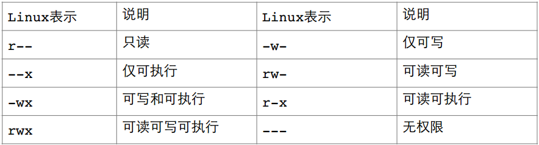
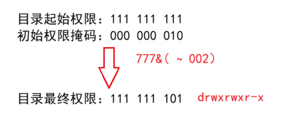

# Linux 的权限概念

权限可以理解为某事是否能被某人做。权限受角色和事物属性有关。

> 比如非军方人员且不被邀请不能踏入军事基地（角色限制），
>
> 再比如不能在视频网站抖音刷OJ题（事物属性限制）。

Linux 下有两种用户：超级用户（root 账号）、普通用户（普通账号）。

* 超级用户：可以在 Linux 系统下做几乎所有的事，不受限制。

* 普通用户：在 Linux 下只能做有限的事。

超级用户的命令提示符是 “#”，普通用户的命令提示符是 “$”。普通用户可以有很多个，但超级用户只能有一个。

一般不建议将普通用户和 root 用户的密码设置成一样。平时的任务也不建议使用root账号（怕失误）。

## whoami指令：查看当前账号的用户名

实际上`[用户名@一堆表示OS的信息 当前目录]$` 就能给出当前的用户名。

```basic
[Bjarne@VM-8-8-centos cppTest]$ whoami
Bjarne
[Bjarne@VM-8-8-centos cppTest]$ 
```


## su指令：从普通账号切换到root

切换账户可使用**命令**：`su [用户名]` 

**功能**：切换用户。

例如，从从普通用户`user`切换到`root`用户则使用 `su root`（或`su`，root可以省略），此时系统会提示输入 `root` 用户的口令（密码）。

```basic
[Bjarne@VM-8-8-centos cppTest]$ whoami
Bjarne
[Bjarne@VM-8-8-centos cppTest]$ pwd
/home/Bjarne/cppTest
[Bjarne@VM-8-8-centos cppTest]$ su
Password: 
[root@VM-8-8-centos cppTest]# whoami
root
[root@VM-8-8-centos cppTest]# pwd
/home/Bjarne/cppTest
[root@VM-8-8-centos cppTest]# exit //或ctrl+D
exit
[Bjarne@VM-8-8-centos cppTest]$ whoami
Bjarne
[Bjarne@VM-8-8-centos cppTest]$ 

```

或`su -`。但这个指令是让 root 账户重新登录，所以路径会切换成根目录。登出后会换回来。

```basic
[Bjarne@VM-8-8-centos cppTest]$ pwd
/home/Bjarne/cppTest
[Bjarne@VM-8-8-centos cppTest]$ su -
Password: 
Last login: Tue Aug 26 21:39:58 CST 2025 on pts/3
[root@VM-8-8-centos ~]# pwd
/root
[root@VM-8-8-centos ~]# 

```

`su`、`su root`和`su -`的区别是后者会将工作目录切换成root的工作目录，退出账号后又会换回来。


## su指令：从root切换到普通账号

要从 root 用户切换到普通用户 user ，则使用 `su user`。 且 root 账户可通过`su 账户名`变成任何普通账户，没有任何拦截。

```basic
[root@VM-8-8-centos ~]# whoami
root
[root@VM-8-8-centos ~]# pwd
/root
[root@VM-8-8-centos ~]# su Bjarne
[Bjarne@VM-8-8-centos root]$ whoami
Bjarne
[Bjarne@VM-8-8-centos root]$ pwd
/root
[Bjarne@VM-8-8-centos root]$ 

```


## su指令：从普通账号切换到另一个普通账号

若是普通用户通过`su 账户名`变成其他普通用户，需要输入那个用户的密码。

```basic
[Bjarne@VM-8-8-centos ~]$ su Bjarne2
Password:  //输入Bjarne2的密码
[Bjarne2@VM-8-8-centos Bjarne]$ 

```


# Linux权限管理

Linux的用户的权限也是依赖或伴生于文件的。文件拥有内容和属性。文件天然具有的属性是读（ r ）、写（ w ）和执行（ x ）。

权限管理一般是指某种角色能执行文件的哪些属性。

## 文件访问者的分类（人）

Linux 的用户角色划分成3种：拥有者，所属组和其他人。

* 文件和文件目录的**所有者**：u---User（拥有者）

* 文件和文件目录的**所有者所在的组**的用户：g---Group（所属组）

* 其它用户：o---Others （其他人）

文件的所属组指对该文件拥有特殊权限的用户的集合。特殊情况一个组可以只有1个人，在Linux，拥有者和所属组在很长时间都是一个人，除非一个组可以有很多人并修改了文件的属性。

一个组可以有很多人，用组长的名字来对组命名。

> 问为什么要有所属组的概念？
>
> 在公司，一般不会允许两个团队做同样的事（项目），因为两个团队的任务重复的话会增加经济负担，甚至会出现某团队剽窃其他团队的创意造成。但也有允许的公司，使得团队之间保持竞争关系。
>
> 但项目文件又不能不给领导看，所以新增所属组的概念，将领导加入项目所属组。

## 文件类型和访问权限（事物属性）

### 文件属性格式

通过`ll`（或`ls -l`）查看文件的属性：

```basic
[Bjarne@VM-8-8-centos test]$ ll
total 16
-rw-rw-r-- 1 Bjarne Bjarne   85 Aug 27 00:02 Bjarne.cpp
-rwxrwxr-x 1 Bjarne Bjarne 8808 Aug 27 00:05 Bjarne.exe
-rw-r--r-- 1 root   root      0 Aug 26 23:59 root.cpp
[Bjarne@VM-8-8-centos test]$ 

```

例如`-rwxrwxr-x`表示文件所对应的属性，第1个`-`表示文件类型。后9列每3个为1组，第1组为拥有者所具有的权限，第2组为所属组的权限，第3组为其他人的权限。整个结构如下图所示。


这个属性中没有列出其他人（`o`，Others），是因为其他人可能存在无限多个列举不完，且无论有没有都对文件属性无任何实质性的影响，所以没必要列出。


### 文件类型

在Windows，区分文件类型用的是**文件后缀**（也叫文件拓展名）。而 Linux 区分文件类型和后缀无关（在系统层面）。

Linux 区分文件类型和**是否有可执行权限**有关。后缀更多是给用户看的，给用户传达一些基本的属性信息（比如 .txt 是普通文本，.exe 是可执行程序）。

但 Linux 不通过文件后缀区分文件，不代表 Linux 管理的程序通过文件后缀区分文件。而且Linux有的工具是识别文件后缀的（比如 gcc 和 g++），在这个层面文件后缀的存在就有意义。

Linux通过文件属性的第1个字符表示文件属性。文件属性可通过`ll`查看。

```basic
[Bjarne@VM-8-8-centos test]$ ll
total 16
-rw-rw-r-- 1 Bjarne Bjarne   85 Aug 27 00:02 Bjarne.cpp
-rwxrwxr-x 1 Bjarne Bjarne 8808 Aug 27 00:05 Bjarne.exe
-rw-r--r-- 1 root   root      0 Aug 26 23:59 root.cpp
[Bjarne@VM-8-8-centos test]$ 
```

例如信息`-rw-rw-r-- 1 Bjarne Bjarne   85 Aug 27 00:02 Bjarne.cpp`，
第1个字符 `-` 就表示 Linux 将这个文件识别出来的文件类型。

类似的文件类型：

* `d`：文件夹，或目录文件。
* `-`：普通文件。包括源代码、可执行程序、（动、静态）库等。
* `l`：链接问价软链接（链接文件，类似 Windows 的快捷方式，本质是方便用户快速打开指定程序）。
* `b`：块设备文件（例如硬盘、光驱等）。
* `p`：管道文件。
* `c`：字符设备文件（例如屏幕、键盘等串口设备）。
* `s`：套接口文件。

基本权限

1. 读（r/4）：Read对文件而言，具有读取文件内容的权限；对目录来说，具有浏览该目录信息的权限。

2. 写（w/2）：Write对文件而言，具有修改文件内容的权限；对目录来说具有删除移动目录内文件的权限。

3. 执行（x/1）：execute对文件而言，具有执行文件的权限；对目录来说，具有进入目录的权限。

4. `-` 表示不具有该项权限。

### 字符设备文件

向显示器打印数据时是以字符为单位打印的。无论是c语言的`printf`，还是c++的`cout`，Python的`print`或者Java的`sout`（`System.out.print`），无论原始数据是什么，**打印在显示器上的都是字符串**。

其中**格式化输出**是将数据根据指定的格式转换成字符串，再输出。

从键盘中输入的数据也是字符，通过**格式化输入**给对象（如c语言的`scanf`）。

在Linux，显示器和键盘都是字符设备文件。可通过`ls /dev/tty*`查看所有的字符文件，`tty`是终端的意思，同样的终端设备还有`pts`。向这些文件写入字符串，可以将字符串从一个终端向另一个终端输出（前提是2个会话是同一个操作系统，每打开一个终端相当于打开一个字符设备文件）。

例如这里找到Bjarne账户所属的`pts/1`，向这个终端输入字符串，可在另一个用户输出字符串。


### 块设备文件

块设备对数据是以块为单位进行处理的，最典型的块设备是磁盘，或者对磁盘（硬盘）所对应的分区，这些东西是叫块设备文件。

在Linux中，磁盘也被当成一个文件来看待。

例如，Linux中的块设备文件：

```basic
[root@VM-8-8-centos ~]# df -h
Filesystem      Size  Used Avail Use% Mounted on
devtmpfs        989M     0  989M   0% /dev
tmpfs          1000M   24K 1000M   1% /dev/shm
tmpfs          1000M  496K  999M   1% /run
tmpfs          1000M     0 1000M   0% /sys/fs/cgroup
/dev/vda1        50G  3.9G   44G   9% /
tmpfs           200M     0  200M   0% /run/user/0
[root@VM-8-8-centos ~]# ls /dev/vda1
/dev/vda1
[root@VM-8-8-centos ~]# ls /dev/vda* -l
brw-rw---- 1 root disk 253, 0 Aug 13 23:48 /dev/vda
brw-rw---- 1 root disk 253, 1 Aug 13 23:48 /dev/vda1
[root@VM-8-8-centos ~]# 

```

### 链接文件

```basic
[root@VM-8-8-centos ~]# ll /
total 72
lrwxrwxrwx.   1 root root     7 Mar  7  2019 bin -> usr/bin  //l开头
dr-xr-xr-x.   5 root root  4096 Jul  8  2024 boot
drwxr-xr-x    2 root root  4096 Nov  5  2019 data
//这里省略若干...
//ls -l /usr/lib  
```

这里`bin -> usr/bin`，左侧是链接，右侧是具体文件。

可通过指令`ln`建立链接：`ln -s pathname linkname`。

### 管道文件

管道文件主要用于进程间通信。

`mkfifo pipe`：建立一个管道文件 pipe。管道可以暂时存储一条指令的结果。


## 文件权限值的表示方法

对文件的信息`-rwxrwxr-x 1 Bjarne Bjarne 8808 Aug 27 00:05 Bjarne.exe`，其中从第2个字符开始的`rwxrwxr-x`，每3个为一组，这3组权限信息分别表示拥有人、所属组和其他人的权限。

这3组权限信息均使用同一套字符表示方法表示权限：



对每种权限，按照拥有权限为真，没有权限为假，3个权限可表示3个 bit 位，所以可使用八进制数值表示所有权限：


删除文件属于`w`权限，但和当前文件的权限无关，而是和目录的权限有关。

## 文件访问权限的相关设置方法

### sudo指令：提升权限

若只想用 root 账户执行命令，没有必要变成 root 账号，还可以通过 `sodu` 提升普通账户的权限。

`sudo ls`是普通用户提升对当前目录的权限至 root 平齐，但第一次要输入密码（普通账户所属的），之后不用输入密码，做的行为的属性中会被当成 root 执行，但有时间限制（一般几分钟或十几分钟）。

一般新建的用户是不能使用`sudo`指令的，需要将新建的用户加入`sudoers`中，可以理解为加入白名单。

```basic
[Bjarne@VM-8-8-centos cppTest]$ whoami
Bjarne
[Bjarne@VM-8-8-centos cppTest]$ pwd
/home/Bjarne/cppTest
[Bjarne@VM-8-8-centos cppTest]$ touch Bjarne.cpp
[Bjarne@VM-8-8-centos cppTest]$ ls
Bjarne.cpp
[Bjarne@VM-8-8-centos cppTest]$ sudo ls
[sudo] password for Bjarne:  # 这里没配置权限，所以不能使用sudo
Bjarne is not in the sudoers file.  This incident will be reported.
[Bjarne@VM-8-8-centos test]$

```

这里将新用户 Bjarne 添加到`sudoers`中，也就是白名单中。首先切换到`root` 账号，打开`sudoer`文件进行编辑。这里使用 vim 打开。

```basic
[root@VM-8-8-centos ~]# vim /etc/sudoers

```

之后翻到约100行时（vim 可在命令模式下输入`set nu`显示行号），可以找到
 “## Allow root to run any commands anywhere ”，这里的列表就是信任列表。

在这里将 Bjarne 添加到信任列表中即可。保存时可能会弹出警告不让保存，可以使用`!`强制保存。其他用户也可以这样添加。


之后普通用户 Bjarne 就可以使用 `sudo` 提升权限。

```basic
[Bjarne@VM-8-8-centos ~]$ sudo ls
[sudo] password for Bjarne: 
awork  t.txt
[Bjarne@VM-8-8-centos ~]$ 

```


### chmod：修改文件权限

**功能：**设置文件的访问权限

**格式：**`chmod [参数] 权限 文件名`

**常用选项：**

`R ->` 递归修改目录文件的权限

说明：只有文件的拥有者和 root 才可以改变文件的权限

用户表示符`+/-=`权限字符

`+`: 向权限范围**增加权限**代号所表示的权限。

`-`: 向权限范围**取消权限**代号所表示的权限。

`=`: 向权限范围**赋予权限**代号所表示的权限。

用户符号：  

`u`：拥有者

`g`：拥有者同组用（所属组）

`o`：其它用户（其他人）

`a`：所有用户

实例：

```basic
# chmod u+w /home/abc.txt # 为拥有者增加写的权限
# chmod o-x /home/abc.txt # 为其他人剥夺执行的权限
# chmod a=x /home/abc.txt # 为所有人赋予写的权限
# chmod o=rwx filepath # 为其他人赋予所有权限
# chmod u+rw,g+rw,o+r filepath # 为所有人分别赋予权限
# chmod a-w filepath  # 为其他人赋予所有权限
# chmod 666 filepath # 为所有人分别赋予权限
```

效果（给其他人赋予写的权限）：

```basic
[Bjarne@VM-8-8-centos cppTest]$ ll
total 0
-rw-rw-r-- 1 Bjarne Bjarne 0 Aug 26 22:08 Bjarne.cpp
[Bjarne@VM-8-8-centos cppTest]$ chmod o+w Bjarne.cpp # 为其他人添加权限
[Bjarne@VM-8-8-centos cppTest]$ ll
total 0
-rw-rw-rw- 1 Bjarne Bjarne 0 Aug 26 22:08 Bjarne.cpp # 可以看到权限修改
[Bjarne@VM-8-8-centos cppTest]$ cat Bjarne.cpp # 初始没有内容
[Bjarne@VM-8-8-centos cppTest]$ su Bjarne2 # 切换其他用户
Password: 
[Bjarne2@VM-8-8-centos cppTest]$ ll
total 0
-rw-rw-rw- 1 Bjarne Bjarne 0 Aug 26 22:08 Bjarne.cpp
[Bjarne2@VM-8-8-centos cppTest]$ vim Bjarne.cpp # 刚刚赋予权限，可以修改
[Bjarne2@VM-8-8-centos cppTest]$ cat Bjarne.cpp 
#include<iostream>
int main(){cout<<"asdfgh\n";return 0;}
[Bjarne2@VM-8-8-centos cppTest]$ 

```

也可以使用八进制数表示权限：

```basic
[Bjarne@VM-8-8-centos ~]$ ll
total 4
-rw-rw-r-- 1 Bjarne Bjarne 58 Sep  1 22:04 Bjarne.cpp
[Bjarne@VM-8-8-centos ~]$ chmod 000 Bjarne.cpp
[Bjarne@VM-8-8-centos ~]$ ll
total 4
---------- 1 Bjarne Bjarne 58 Sep  1 22:04 Bjarne.cpp
[Bjarne@VM-8-8-centos ~]$ cat Bjarne.cpp
cat: Bjarne.cpp: Permission denied
[Bjarne@VM-8-8-centos ~]$ echo "//abc" >> Bjarne.cpp
-bash: Bjarne.cpp: Permission denied
[Bjarne@VM-8-8-centos ~]$ chmod 664 Bjarne.cpp
[Bjarne@VM-8-8-centos ~]$ ll
total 4
-rw-rw-r-- 1 Bjarne Bjarne 58 Sep  1 22:04 Bjarne.cpp
[Bjarne@VM-8-8-centos ~]$ 
```

非文件拥有者的普通用户不可修改文件的权限，但 root 不受影响。

权限只能匹配一次，例如所属组组长兼拥有者，则只能有拥有者的权限。

### chown：修改文件拥有者

`chown`：change owner，改变拥有者的意思。

**功能**：修改文件的拥有者，也可以更改所属组。

**格式**：`chown [参数] 用户名 文件名`

实例：

```basic
# chown user1 f1
# chown -R user1 filegroup1
```

一般情况某个用户把文件给别人，这个操作不可以。

```basic
[Bjarne@VM-8-8-centos ~]$ ll
total 4
-rw-rw-r-- 1 Bjarne Bjarne 58 Sep  1 22:04 Bjarne.cpp
[Bjarne@VM-8-8-centos ~]$ chown root Bjarne.cpp
chown: changing ownership of ‘Bjarne.cpp’: Operation not permitted
[Bjarne@VM-8-8-centos ~]$ ll
total 4
-rw-rw-r-- 1 Bjarne Bjarne 58 Sep  1 22:04 Bjarne.cpp
[Bjarne@VM-8-8-centos ~]$ 

```

若仍然要硬给，可以使用`sudo`提升权限，但要输入自己的密码，且自己的账号还得在 sudoer 名单里。也可以通过`sudo`将文件的拥有者变成自己。

```basic
[Bjarne@VM-8-8-centos work]$ ll
# 省略一堆文件信息
-rw-rw-r-- 1 Bjarne Bjarne 88900 Sep  8 08:24 t.txt
[Bjarne@VM-8-8-centos work]$ chown root t.txt
chown: changing ownership of ‘t.txt’: Operation not permitted # 无权限
[Bjarne@VM-8-8-centos work]$ sudo chown root t.txt
[sudo] password for Bjarne: 
[Bjarne@VM-8-8-centos work]$ ll
# 省略一堆文件信息
-rw-rw-r-- 1 root   Bjarne 88900 Sep  8 08:24 t.txt # 再查看时拥有者变成了root
[Bjarne@VM-8-8-centos work]$ 

```

还可以更换成 root 账户，通过 root 的超级权限进行拥有者转移。

`chown` 指令支持同时对拥有者和所属组进行修改：

```basic
[Bjarne@VM-8-8-centos work]$ ll
# 省略一堆文件信息
-rw-rw-r-- 1 Bjarne Bjarne 88900 Sep  8 08:24 t.txt
[Bjarne@VM-8-8-centos work]$ sudo chown root:root t.txt
[Bjarne@VM-8-8-centos work]$ ll # 这里已经加入白名单并输入密码，所以不会提示密码的信息
# 省略一堆文件信息
-rw-rw-r-- 1 root   root   88900 Sep  8 08:24 t.txt # 拥有者和所属组发生了改变
[Bjarne@VM-8-8-centos work]$ 

```

**常用选项**：`-R` 递归修改文件或目录的所属组。

`chown [参数] 用户名 文件名`中参数可以选 `-R` 选项，表示将当前目录下的某个目录，连同这个目录所有的文件的拥有者都一起更改。

```basic
[Bjarne@VM-8-8-centos work]$ ll -r cppTest
total 44
-rw-rw-r-- 1 Bjarne Bjarne   445 Sep  8 08:14 a.s
-rw-rw-r-- 1 Bjarne Bjarne  1488 Sep  8 08:15 a.o
-rw-rw-r-- 1 Bjarne Bjarne 16874 Sep  8 08:14 a.i
-rwxrwxr-x 1 Bjarne Bjarne  8352 Sep  8 08:15 a.exe
-rw-rw-r-- 1 Bjarne Bjarne   172 Sep  8 08:16 a.c
[Bjarne@VM-8-8-centos work]$ sudo chown -R root cppTest
[Bjarne@VM-8-8-centos work]$ ll -r cppTest
total 44
-rw-rw-r-- 1 root Bjarne   445 Sep  8 08:14 a.s # 拥有者全部更改
-rw-rw-r-- 1 root Bjarne  1488 Sep  8 08:15 a.o
-rw-rw-r-- 1 root Bjarne 16874 Sep  8 08:14 a.i
-rwxrwxr-x 1 root Bjarne  8352 Sep  8 08:15 a.exe
-rw-rw-r-- 1 root Bjarne   172 Sep  8 08:16 a.c
[Bjarne@VM-8-8-centos work]$ 

```


### chgrp：修改文件所属组

**功能**：修改文件或目录的所属组。和`chown`一样，更换所属组也需要那个组同意，否则只能通过`sudo`或借助 root 进行强制转移。

**格式**：`chgrp [参数] 用户组名 文件名`

```basic
[Bjarne@VM-8-8-centos work]$ ll|grep t.txt
-rw-rw-r-- 1 Bjarne Bjarne 88900 Sep  8 08:24 t.txt
[Bjarne@VM-8-8-centos work]$ sudo chgrp root t.txt
[Bjarne@VM-8-8-centos work]$ ll|grep t.txt
-rw-rw-r-- 1 Bjarne root   88900 Sep  8 08:24 t.txt
[Bjarne@VM-8-8-centos work]$ 

```


**常用选项**：`-R` 递归修改文件或目录的所属组。

```basic
[Bjarne@VM-8-8-centos work]$ ll -r cppTest
total 44
-rw-rw-r-- 1 root Bjarne   445 Sep  8 08:14 a.s
-rw-rw-r-- 1 root Bjarne  1488 Sep  8 08:15 a.o
-rw-rw-r-- 1 root Bjarne 16874 Sep  8 08:14 a.i
-rwxrwxr-x 1 root Bjarne  8352 Sep  8 08:15 a.exe
-rw-rw-r-- 1 root Bjarne   172 Sep  8 08:16 a.c
[Bjarne@VM-8-8-centos work]$ sudo chgrp -R root cppTest
[Bjarne@VM-8-8-centos work]$ ll -r cppTest
total 44
-rw-rw-r-- 1 root root   445 Sep  8 08:14 a.s # 所属组已经更改
-rw-rw-r-- 1 root root  1488 Sep  8 08:15 a.o
-rw-rw-r-- 1 root root 16874 Sep  8 08:14 a.i
-rwxrwxr-x 1 root root  8352 Sep  8 08:15 a.exe
-rw-rw-r-- 1 root root   172 Sep  8 08:16 a.c
[Bjarne@VM-8-8-centos work]$ 

```


### umask：查看或修改权限掩码

在Linux，允许用户设计权限掩码。

**功能**：

查看或修改权限掩码，权限掩码主要看后3位数字。

**语法**：`umask [权限值]`

```basic
[Bjarne@VM-8-8-centos ~]$ umask # 不给权限值时可查看账户的权限掩码
0002
[Bjarne@VM-8-8-centos ~]$ umask 0004
[Bjarne@VM-8-8-centos ~]$ umask
0004
[Bjarne@VM-8-8-centos ~]$ 

```

在Linux，目录的起始权限是777（八进制数，翻译成权限就是 `-rwxrwxrwx`）。而对应的普通文件的起始权限是666（ `-rw-rw-rw-`）。

但实际上创建的文件和目录，看到的权限并不是这些值。原因就是创建文件或目录的时候还要受到`umask`指令的影响。假设默认权限是`mask`，则实际创建的出来的文件权限是: 
`mask & ~umask` ，即凡是在权限掩码中出现的权限，最终都要在起始权限中去掉。

例如目录的权限：

```basic
[Bjarne@VM-8-8-centos ~]$ umask
0002
[Bjarne@VM-8-8-centos ~]$ mkdir dir
[Bjarne@VM-8-8-centos ~]$ ll
total 4
drwxrwxr-x 2 Bjarne Bjarne 4096 Sep  2 12:12 dir
[Bjarne@VM-8-8-centos ~]$ 

```



### file：查看文件名

**功能**：辨识文件类型（通过检查文件开头的一些特定字节）。

**语法**：`file [选项] 文件或目录...` 

```basic
[Bjarne@VM-8-8-centos ~]$ ls
Bjarne.cpp  test.txt  t.txt
[Bjarne@VM-8-8-centos ~]$ file test.txt # 空文件
test.txt: empty
[Bjarne@VM-8-8-centos work]$ file t.txt # 非空文件
t.txt: ASCII text # 非空文件会标注字符类型
[Bjarne@VM-8-8-centos work]$ vim t.txt # 修改这个文件，添加点非ASCII字符比如中文
[Bjarne@VM-8-8-centos work]$ file t.txt
t.txt: UTF-8 Unicode text # 字符类型为万国码
[Bjarne@VM-8-8-centos ~]$ file Bjarne.cpp
Bjarne.cpp: C source, ASCII text # 可以识别c语言、c++的代码
[Bjarne@VM-8-8-centos ~]$ file dir
dir: directory # 目录
[Bjarne@VM-8-8-centos ~]$ file /dev/tty
/dev/tty: character special # 字符设备
[Bjarne@VM-8-8-centos ~]$ file /dev/vda
/dev/vda: block special # 块设备
[Bjarne@VM-8-8-centos ~]$ 

```

**常用选项**：

`-c` 详细显示指令执行过程（文件解析过程），便于排错或分析程序执行的情形。

```basic
[Bjarne@VM-8-8-centos work]$ file -c t.txt
cont	offset	type	opcode	mask	value	desc
[Bjarne@VM-8-8-centos work]$ file t.txt
t.txt: UTF-8 Unicode text
[Bjarne@VM-8-8-centos ~]$ 

```

`file -c`的结果解析：

* `cont`：**继续等级 (Continuation Level)**。表示这条规则是否以及如何依赖于上一条规则的匹配结果。`0` 表示这是一条新的起始规则。
* `offset`：**偏移量 (Offset)**。从文件开头跳过多少字节开始检查。`>0` 表示从文件开始的位置。
* `type`：**数据类型 (Data Type)**。要检查的数据的类型，例如 `string`（字符串）、`belong`（大端序32位整数）、`lelong`（小端序32位整数）等。
* `opcode`：**操作符 (Operator)**。如何将文件内容与期望值进行比较。最常见的是 `=`（等于）。
* `mask`：**掩码 (Mask)**。在与期望值比较前，先对文件内容进行一个位掩码操作。`&0xffffffff` 是一个常见的掩码，表示使用所有位（即不屏蔽任何位）。
* `value`：**期望值 (Value)**。期望文件在指定偏移位置出现的内容。
* `desc`：**描述 (Description)**。如果匹配成功，`file` 命令将输出的描述性字符串。

`file -c` 的结果是一个表格，但这里只列出每个操作的开头部分的表头。

------

`-z` 尝试去解读压缩文件的内容。它只会探测第1个文件的类型。

```basic
[Bjarne@VM-8-8-centos work]$ tree .
.
|-- cppTest
|   |-- a.c
|   |-- a.exe
|   |-- a.i
|   |-- a.o
|   `-- a.s
|-- pyTest
|-- t2.txt
`-- t.txt

2 directories, 7 files
[Bjarne@VM-8-8-centos work]$ tar -cf cppTest.tar cppTest
[Bjarne@VM-8-8-centos work]$ file -z cppTest.tar
cppTest.tar: POSIX tar archive (GNU)
[Bjarne@VM-8-8-centos work]$ 

```


# 目录的权限和粘滞位

使用一个目录做事，需要的权限：

* 可执行权限：表示用户在目录下执行命令的权限。如果用户在目录没有**可执行权限** ( x )，即使目录仍然有可读读权限，也无法对目录执行任何命令，包括通过`cd`进入目录。

* 可读权限：表示用户在目录下查看文件的权限。如果目录没有**可读权限** ( r )，则无法用`ls`等命令查看目录中的文件内容。

* 可写权限：表示用户在目录下修改目录的权限。如果目录没有**可写权限** (w)，则无法在目录中创建文件, 也无法在目录中删除和修改文件。

  ```basic
  [root@VM-8-8-centos Bjarne]# ll
  total 4
  drwxr-xr-x 2 root root 4096 Sep  2 16:00 rootdir # 查看目录的权限
  [root@VM-8-8-centos Bjarne]# cd rootdir
  [root@VM-8-8-centos rootdir]# cat t.txt # root拥有所有文件的最高权限
  root
  [root@VM-8-8-centos rootdir]# su Bjarne # 切换为普通账户
  [Bjarne@VM-8-8-centos rootdir]$ cat t.txt
  root
  [Bjarne@VM-8-8-centos rootdir]$ echo "Bjarne">>t.txt # 不可修改
  bash: t.txt: Permission denied
  [Bjarne@VM-8-8-centos rootdir]$ rm -f t.txt # 不可删除
  rm: cannot remove ‘t.txt’: Permission denied
  [Bjarne@VM-8-8-centos rootdir]$ touch t2.txt # 不可在当前目录创建文件
  touch: cannot touch ‘t2.txt’: Permission denied
  [Bjarne@VM-8-8-centos rootdir]$ cd ..
  [Bjarne@VM-8-8-centos ~]$ rm -fr rootdir  # 不可删除目录
  rm: cannot remove ‘rootdir/t.txt’: Permission denied
  [Bjarne@VM-8-8-centos ~]$ 
  
  ```

  

基于这些权限，Linux 存在致命的缺陷：只要用户具有目录的写权限，无论这个用户是否有这个文件的写权限，用户就可以删除目录中的文件。这也是为什么普通账户的起始权限是0002（防止其他人写这个文件、目录）。

> 这个特性类似于：毁灭你，与你何干。

一般情况下，新建的普通账户的所有权限是077，即只有自己能操作。因此一般情况下不会有普通账户进入到自己的目录对自己的目录进行破坏。

```basic
[root@VM-8-8-centos ~]# cd /home
[root@VM-8-8-centos home]# ll
total 12
drwx------ 4 Bjarne     Bjarne     4096 Sep  2 12:51 Bjarne
drwx------ 4 Bjarne2    Bjarne2    4096 Aug 27 14:46 Bjarne2
drwx------ 2 lighthouse lighthouse 4096 Aug 13 23:48 lighthouse
[root@VM-8-8-centos home]# 

```

但总有特殊情况，例如多个账号互相协同工作，或不同用户在 Linxu 根目录操作（比如在根目录创建一个公共目录 shared，所有人都在这里创建文件进行数据共享）。于是为了解决这个不科学的问题，Linux引入了**粘滞位**（$\text{ni\'an}\ \text{zh}\grave{\imath}\ \text{w\`ei}$）的概念。

当一个目录被设置为"粘滞位"(用`chmod +t 目录`)，则该目录下的文件只能由这些账户删除：

一、超级管理员即 root 账户。

二、该目录的所有者。

三、该文件的所有者。

粘滞位只能给目录添加。

```basic
[root@VM-8-8-centos /]# ls # 在根目录建立一个shared即共享文件夹
bin  boot  data  dev  etc  home  lib  lib64  lost+found  media  mnt  opt  proc  root  run  sbin  srv  sys  test  tmp  usr  var
[root@VM-8-8-centos /]# mkdir shared
[root@VM-8-8-centos /]# chmod +t shared
[root@VM-8-8-centos /]# ll
# 省略
drwxr-xr-t    2 root root  4096 Sep  2 15:01 shared # 增加粘滞位
drwxr-xr-x.   2 root root  4096 Apr 11  2018 srv
# 省略
[root@VM-8-8-centos /]# 

```


