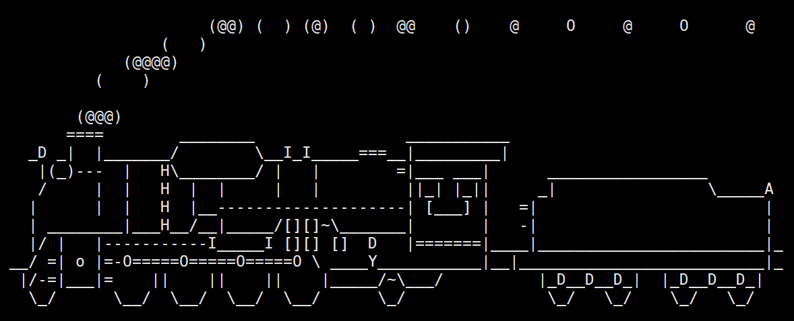

# 软件包管理器 yum

## Linux的软件安装方式

所有的Linux在宏观上可分两类：红帽和ubuntu。CentOS也是红帽系列。两个版本的绝大部分内容完全相同，所以学好一门操作系统，其他操作系统都能使用。

不同发行版的主要差别在于安装软件。CentOS下做软件卸载、安装需要使用yum软件。

在Linxu中安装软件和在windows上类似。但在Linux安装软件的方法相对windows多一些。

1. 源代码安装。

   一般 Linxu 的很多工具在安装时大部分工具是开源的，所以作者不编译，由用户自行编译，编译出错了要自己解决。一般代码中都会自带自动化安装的脚本，编译好后就能安装。

   编译对新手并不友好，也不推荐，即使是 Linux 老手，也会尽量规避源代码安装，因为问题很多。 

   > 早些年，基本每一个后台工程师在进入公司时，首先就是给自己搭建环境，在 Linux上配置开发环境快的2、3天，慢的2周甚至更久才能把环境弄好。源代码很容易缺功能，缺功能反倒是其次，特别是编译错误，有可能代码有移植性问题，在交叉编译（在一个平台生成另一个平台可运行的程序）时很可能编译不通过。
   >
   > 在 windows，直接通过源代码编译形成可执行程序，再运行可执行程序进行安装也是闻所未闻，从来没听过英雄联盟的运营公司将将源代码交给用户，让用户自己编译，用户水平参差不齐，必定会问候游戏公司。

2. RPM包安装。

   在Linux，也有人将软件编译并打包好，形成一个RPM包（Red Hat Package Manager，红帽软件包管理器），然后使用对应的RPM包将软件安装上去。

   > 举个例子，例如创建一个 .c 源代码，实现了一个功能，然后编译得到exe 文件，将这个 exe 文件改名，并移植到 Linux 的 bin 目录，就能像其他指令一样使用。首先移植到 bin 目录需要用 `sudo` 指令提升权限，或委托 root 账户移植。
   >
   > 因此软件安装的本质就是把可执行程序拷贝到指定路径下，这是最基本、最浅显的理解。平时在windows下看到的安装进度界面，就是将这个过程更细致化，也不影响这个本质。
   >
   > 也有一些特殊软件，可能需要修改更高权限的配置文件之类的。

   在Linux，RPM包安装也可以使用RPM命令安装，相当于是解压加移动到指定目录。

   一般也不推荐RPM包安装，因为不一定清楚要安装哪个软件，也不一定知道哪个软件是对的，甚至还有的软件需要依赖其他软件否则不能运行。就比如c语言编译成的程序，其实是依赖编译时的计算机的动态库，若将动态库删除，或程序移植到其他没有对应库的计算机，程序就无法运行。

3. `yum` 一键式安装

   `yum` ( Yellow dog Updater, Modified ）是 Linux下非常常用的一种软件包管理器。主要应用在 Fedora，RedHat，Centos 等发行版上。使用`yum` 安装相当于将适配当前设备版本的 RPM 包下载好并安装。

   可以简单理解为`yum` 是一个**指令**。对一个软件的生命周期的管理，从下载安装、查找到卸载，整个流程都可以使用 `yum`这个工具。

   当用户想要安装某些软件时，`yum` 就可以直接根据对应的软件名，自动去软件源里去搜索，找到后自动下载软件包，在本地解压、拷贝、安装到 Linux 中。红帽系列的 Linux 基本都是使用 `yum`。

   软件之间可能存在依赖关系，`yum` 也能统一解决。

   > 2012、2013年那段时间，智能手机并不普及，大部分人要安装软件、上网都只能在电脑，大部分都是通过百度或者其他渠道搜索下载下来直接装，没有统一的安装软件、查找软件的入口，所以下载下来的软件有很多问题比如广告全家桶。
   >
   > 现在一般不会直接去浏览器上搜，大部分都会在软件商店或应用管家去找，这个软件商店和应用管家一般不能卸载。
   >
   > 在手机上装软件需要找软件商店，对应的就是在 Linux 上找 `yum`，`yum` 在 Linux 的地位和手机上的软件商城是一样的。

Linux 的操作界面一般都是命令行窗口，并不像手机或者 windows 的 GUI，Linux 的软件也和带 GUI 的 windows 不同。

首先是在没有安装时，软件并不在 Linux 的目录下，而是在服务器端。安装软件需要先下载软件，再安装，应用商店相当于一个提供软件下载渠道的客户端。

> 手机上所有软件几乎全都是客户端。
>
> 在2012、2013年，下载软件一般都在官网下载，现在几乎都是手机厂商提供服务器端下载APP客户端。一般手机厂商的服务器端提供下载的软件客户端由各个公司提供。这时一般就不会直接访问企业官网下载了。
>
> `yum` 的地位相当于手机厂商的应用商店，但功能更多。yum背后的服务器端的软件相比手机，基本都是开源的，由 Linux 维护者和作者制作。

## yum相关的生态

### 镜像软件

评价一款操作系统好与不好，不能只用源代码去评价它的好坏，需要匹配OS的社区、官方文档和配套软件，即这款OS产品对应的生态。

例如CentOS 7，社区活跃，各种不同的版本出现的BUG基本都被暴露出并处理，配套软件例如监视软件、开发要用的库基本满足需求，其他公司都在用。

大公司用的操作系统也是这个操作系统生态好的表现，原因是：

1. 大公司都有技术团队，
2. 大公司是问题复现的高频场景。

所以某个操作系统，只要大公司在用，问题会很快暴露，也会很快修复。

而且 Linux 本身是开源的，会吸引很多使用操作系统的人，这些人分工不同：有人研究内核的，有人研究应用开发的，其中就有人基于应用开发，在 Linux 中做出一系列的开源软件。这些开源软件就可以为 Linux 提供软件功能支持。这也是 `yum` 的软件客户端的来源。

`yum` 中的文件内置了域名、IP地址等，这些信息提供了软件的来源信息。

这些软件很多都是国外制作的，包括提供软件下载来源的服务器端。这就使得即使知道软件的来源，若这个来源指向国外则无法访问或访问时网速太慢。

根据上述分析，一定有人不希望访问这些软件受到限制，于是他们也准备一些服务器放在国内，将国外的软件下载到本地的服务器，或将国外的软件源码编译生成软件。这样就不用每次都访问国外的服务器端，这些被搬运的软件被称为**镜像**。常见的镜像源有[网易镜像源](http://mirrors.163.com/)，[ 清华大学开源软件镜像站](https://mirrors.tuna.tsinghua.edu.cn/help/pypi/)等。

查看`yum`的存在：`ls /etc/yum.repos.d`，这个目录下的文件基本都是系统或使用者配置的 `yum`源。

其中的 CentOS-Base.repo （CentOS基础软件源）是最重要的软件源，里面主要存放各种链接，#开头的下载源是被禁掉的，这个下载源一般都是国外的，且部分云服务器直接没有，取而代之的是国内的镜像源。

镜像源中的仓库结构：

```basic
[base]
name=CentOS-$releasever - Base
mirrorlist=http://mirrorlist.centos.org/?release=$releasever&arch=$basearch&repo=BaseOS&infra=$infra
#baseurl=http://mirror.centos.org/$releasever/BaseOS/$basearch/os/
gpgcheck=1
gpgkey=file:///etc/pki/rpm-gpg/RPM-GPG-KEY-centosofficial
enabled=1
```

* `[base]`： **仓库ID**，这是仓库的唯一标识符，在中括号内定义。你在 yum 命令的输出中会看到它。
* `name`： 仓库的人类可读名称，用于描述这个仓库。
* `mirrorlist` 或 `baseurl`： 定义软件的下载来源。
  * `mirrorlist`：指向一个包含多个镜像站地址的列表文件，`yum` 会自动选择最快的一个。
  * `baseurl`：直接指定一个或多个固定的仓库地址（可以是 http、https、ftp 或本地 `file://` 路径）。这里加 # 是为了能选择更快的下载源，将这个基础地址给禁掉。
* `gpgcheck=1`： 设置为 1 时，`yum` 会检查从仓库下载的软件包的 GPG 签名，以确保软件包没有被篡改，保证安全。
* `gpgkey`： 指定用于校验签名的 GPG 公钥的位置。
* `enabled=1`： 设置为 1 表示启用这个仓库；设置为 0 则表示配置但禁用这个仓库。

也有的服务器是选择禁掉`mirrorlist`，用`baseurl`。例如阿里云的某 `yum` 源：

```basic
[base]
name=CentOS-$releasever - Base - 163.com
#mirrorlist=http://mirrorlist.centos.org/?release=$releasever&arch=$basearch&repo=os
baseurl=http://mirrors.163.com/centos/$releasever/os/$basearch/
gpgcheck=1
gpgkey=http://mirrors.163.com/centos/RPM-GPG-KEY-CentOS-7
```

也有将不用的链接直接去掉的。例如腾讯云：

```basic
[root@VM-8-8-centos ~]# cat /etc/yum.repos.d/CentOS-Base.repo
[extras]
gpgcheck=1
gpgkey=http://mirrors.tencentyun.com/centos-vault/RPM-GPG-KEY-CentOS-7
enabled=1
baseurl=http://mirrors.tencentyun.com/centos-vault/7.9.2009/extras/$basearch/
name=Qcloud centos extras - $basearch
# 省略
[root@VM-8-8-centos ~]# 

```

### yum的生态

理解 `yum` 的出现需要理解 `yum` 的整个生态。

当使用 Linux 的人多时，很多人不希望这个社区和 Linux OS没落，都会参与 Linux 建设，即使没人参与，这些写 Linux 内核的人也会亲自下场。所以基本不用担心 Linux 的软件没人写。

然后就是服务器设备，不是所有的开源都是免费的（但可以确定，CentOS，即Community Enterprise Linux Operating System是免费的，因为是社区版）。一个免费的社区没有经济来源，这样的云服务器和服务器资源，几乎没有人提供。

参与 Linux 建设的人基本都不缺钱。一旦这个项目走上正轨时，就会有公司愿意使用，这个项目也会被纳入这个公司的生态体系里，之后操作系统配套的版本、工具就会被公司拿来用。凡是使用 Linux 及其配套软件的公司、个人或组织，自然不会希望这个社区出现任何问题。

因为这个产品免费且开源，可以给自己零成本使用，自己使用了它就和它产生了关联，自己也不希望它出问题，一旦它出问题，就得将自己的东西修改，这个过程很麻烦。所以使用过Linux 的人感受到 Linux 的好处时，都不会希望它出问题，肯定会有人给 Linux 进行资助。于是服务器设备和设备上的开源软件维护的资金就有了来源。


## yum 查看软件包

### 通过yum查看当前的软件包

* 通过 `yum list` 命令可以罗列出当前一共有哪些软件包。

罗列的软件包存储于远端仓库，由于包的数目可能很多，需要使用 `grep` 命令只筛选出我们关注的包。例如：rz/sz命令，这个工具用于 windows 机器和远端的 Linux 机器通过 XShell 传输文件。

安装完毕之后可以通过拖拽的方式将文件上传过去。

```basic
[root@VM-8-8-centos ~]# yum list | grep lrzsz
Repository epel is listed more than once in the configuration
lrzsz.x86_64                             0.12.20-36.el7                @os      
[root@VM-8-8-centos ~]# 

```

筛选出的软件包：

```basic
lrzsz.x86_64 0.12.20-36.el7 @os      
```

这个软件包的各个成分：

* `lrzsz`：软件包名。或软件的名称。
* `.x86_64`：架构。
* `0.12.20`：版本号。由上游开发者（软件原作者）定义。
* `-36`：发布号。由打包者（这里是CentOS/RHEL团队）定义，表示他们为同一个版本的软件打了多少次包。
* `.el7`：发布版表示。表示该软件包是为何种Linux发行版构建的。
* `@os`：仓库来源。表示这个软件包是**从哪个仓库安装的**，以及其**当前状态**。`os` 仓库通常对应着 `/etc/yum.repos.d/` 目录下某个 .repo 文件中定义的 `[os]` 部分。

可以将软件`lrzsz.x86_64`这个名称拷贝后再去安装。也可以只用`lrzsz`这个软件名安装。

其他的标准的RPM包的名格式: 
`软件包名-主版本号.次版本号.源程序发行号-软件包的发行号.主机平台.cpu架构`。

"x86_64" 后缀表示64位系统的安装包，"i686" 后缀表示32位系统安装包。选择包时要和系统匹配。

"el7" 表示操作系统发行版的版本， "el7" 表示的是 centos7或redhat7。"el6" 表示 centos6或redhat6。

### 通过配置文件查看软件源

`yum` 在安装软件时会读取配置文件，这些配置文件包含软件的下载链接。在安装软件时会找到带 `mirrors` 的下载链接下载软件，没有则去找原始链接。

最重要的配置文件是 CentOS-Base.repo。`yum` 会在 CentOS-Base.repo 中寻找软件链接，更新 `yum` 源是把配置文件 CentOS-Base.repo 用包含国内下载链接的仓库文件替换同类型的文件。

```basic
[root@VM-8-8-centos ~]# cat /etc/yum.repos.d/CentOS-Base.repo
[extras]
gpgcheck=1
gpgkey=http://mirrors.tencentyun.com/centos-vault/RPM-GPG-KEY-CentOS-7
enabled=1
baseurl=http://mirrors.tencentyun.com/centos-vault/7.9.2009/extras/$basearch/
name=Qcloud centos extras - $basearch
# 省略
[root@VM-8-8-centos ~]# 

```

这个是基础 `yum` 源，包含的链接的软件是官方软件，这些软件经过官方的测试比较稳定，可比较放心地使用。

除了官方的软件源，还有`epel` 扩展软件源，这些软件并不放在官方软件源。通过`ls /etc/yum.repos.d`可查看。`epel.repo`就是扩展软件源的配置文件，包含扩展软件源的链接。

```basic
[root@VM-8-8-centos ~]# ls /etc/yum.repos.d
CentOS-Base.repo  epel.repo
CentOS-Epel.repo  epel-testing.repo
[root@VM-8-8-centos ~]# 

```

## yum 安装和卸载软件

若云服务器的Linux中没有 epel.repo，可以使用 `yum`的指令安装。

```basic
yum install epel-release
```

通过 `yum` 安装软件：

```basic
yum install lrzsz
```

`yum` 会自动找到都有哪些软件包需要下载，这时候敲 "y" 确认安装。

出现 "complete" 字样，说明安装完成。

> 安装软件时由于需要向系统目录中写入内容，一般需要使用 `sudo` 提升权限或者切到 root 账户下才能完成。

`yum` 安装软件只能一个装完了再装另一个。正在 `yum` 安装一个软件的过程中，如果再尝试用`yum`安装另外一个软件，`yum`会报错。

卸载软件依旧可以用`yum`：

```basic
yum remove lrzsz
```

可加 `-y` 选项让 Linux 不提示。

例如`yum remove -y lrzsz`。


## 一些软件的安装和卸载

关于 `yum` 的所有操作必须保证主机（虚拟机）网络畅通。

可以通过 `ping` 指令进行验证。

```basic
ping www.baidu.com
```

这里参考 [CentOS好玩的命令_敬故的技术博客_51CTO博客](https://blog.51cto.com/u_16052008/6166616)。

例如输错指令会召唤字符组成的火车：

```basic
[root@VM-8-8-centos ~]# yum clean all
# 一般新装的CentOS需要重新生成 yum 缓存。这里先清理，同时省略一堆xshell的信息
[root@VM-8-8-centos ~]# yum makecache
# 生成缓存
[root@VM-8-8-centos ~]# yum -y install epel-release
# 配置yum扩展源，即epel.repo
[root@VM-8-8-centos ~]# yum -y install sl
# 可以用全名sl.x86_64
# 这句是正式安装火车指令，这里省略若干安装流程
Complete! # 表示安装完成
[root@VM-8-8-centos ~]# sl

```

演示效果：



例如`cowsay`：

```
# 重新生成 yum 缓存并配置，已经配置过就不必再配置
[root@VM-8-8-centos ~]# yum install cowsay -y、
# 同样省略一堆流程
Complete!
[root@VM-8-8-centos ~]# cowsay "口吐芬芳"
 ______
< 口吐芬芳 >
 ------
        \   ^__^
         \  (oo)\_______
            (__)\       )\/\
                ||----w |
                ||     ||
[root@VM-8-8-centos ~]# 

```


## yum源的更新

部分 Linux 的机器，yum 源的链接可能是国外的，需要转换成国内的镜像网址。替换 yum 源就是备份当前的 文件，然后去下载新的 yum 源。可以参考[五步搞定Centos7 更换国内的yum源问题_centos7更换国内源-CSDN博客](https://blog.csdn.net/logic_c/article/details/84075132?ops_request_misc=&request_id=&biz_id=102&utm_term=五步搞定Centos 7 更换国内的yum源问题&utm_medium=distribute.pc_search_result.none-task-blog-2~all~sobaiduweb~default-0-84075132.142^v102^control&spm=1018.2226.3001.4187)。

一般云服务器例如腾讯云、阿里云一般都会配置，真正需要配置的环境还是虚拟机。