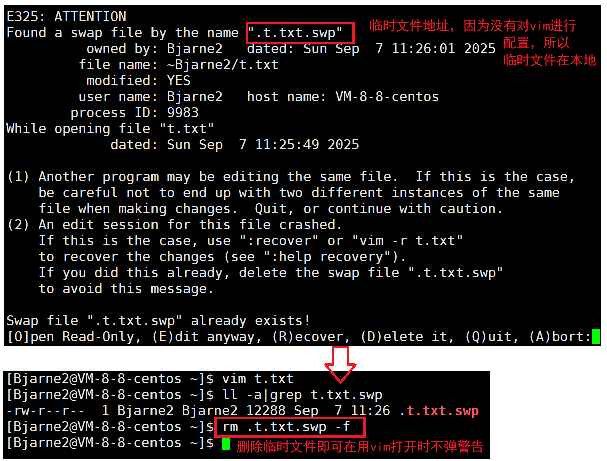

# Linux的编辑器 vim

vi 和 vim 都是**多模式文本编辑器**（主要工作是写代码和写文本，但不能编译代码，功能上类似于Visual Studio Code），但不能完成职责外功能。

vim 是 vi 的升级版本，它不仅兼容 vi 的所有指令，而且还有一些新的特性在里面。例如语法加亮，可视化操作不仅可以在终端运行，也可以运行于window、 macOS、windows，很多 OS 都有 vim。

> vi 是旧时代的开发工具。现在除非是做系统级开发、嵌入式开发、简单版本的应用级别开发，否则绝大多数场景都是做 windows 和 linux 进行配合开发。

## 简单使用vim

若只想将 vim 当成临时的记事本进行编辑，则看完简单使用 vim 即可跳过。

使用 vim 写文本的流程：

1. 创建文本文件。可以是 .c、.txt、.java、.py等。
2. 通过 `vim file` 指令打开文件进行编辑。例如创建文件 t.txt，然后用 vim 打开。

```basic
[Bjarne@VM-8-8-centos ~]$ touch t.txt
[Bjarne@VM-8-8-centos ~]$ vim t.txt
# 这时进入文本的编辑界面
```

3. 初次进入 vim 界面时是**一般模式**（或**命令模式**），在这个模式下：
   * 不能进入编写程序。
   * 可以使用光标上下移动切换位置。
   * 按<kbd>i</kbd>切换到**编辑模式**。
   * 输入 ":" 切换到**底行模式**。
   
   例如这是 vim 打开某个文本后的一般模式界面（调整了大小）。


4. 进入**编辑模式**编写文件。写完后按<kbd>ESC</kbd>退出编辑模式，回到**命令模式**。
   1. 在底行会出现 `-- INSERT --` 。
   2. 随意编写程序或输入字符（就跟windows的记事本是一致的）。
   3. 编辑模式下不能保存退出，只有底行模式才能保存退出。
   4. 按<kbd>ESC</kbd>退出编辑模式，切换到**命令模式**。


5. 在**命令模式**，输入 “:” （<kbd>shift</kbd> + <kbd>;</kbd>）进入**底行模式**：
   
   1. 在底行出现 ":"。
   
    2. 输入`w`: 保存， 输入`q`: 退出，`!`: 强制执行。若文件出现修改且没保存，直接退出即输入 `q` 会报错，需要使用 `wq` 保存并退出，或 `!q` 强制退出并使文本恢复原来的内容。
    3. 输入指令之后直接按回车，就可以切换到 linux 命令行。


```
[Bjarne@VM-8-8-centos ~]$ touch t.txt
[Bjarne@VM-8-8-centos ~]$ vim t.txt
[Bjarne@VM-8-8-centos ~]$ # 这时就像没发生过一样，再查看文件时内容可能发生变化
```

在底行模式，使用`!`强制执行的其他场景：

1. 当前文件是一个配置文件，拥有者是root，即使自己是 root 账号或 `sudo` 提升权限，若 shell 发现用户改的这个配置文件比较重要，则 shell 会警告，或直接阻止保存，此时就可以用 `!` 强制保存。
2. 修改了文件但没保存直接退出（`!q`）。

若使用了 vim 修改文件，没来得及保存就直接退出 xshell 或关闭虚拟机，或把电脑关了，这时会产生一个 `.文件.swp` 的临时备份文件，swp是临时文件的意思。因为这个文件的存在，使用 vim 打开这个文件时会弹出一堆警告命令。此时删除  .文件.swp 即可。



对 vim 进行配置后，临时文件的路径可能会发生更改。


用 vim 打开一个不存在的文件，只要没保存，文件不会存在；只要保存了，就会新创建一个文件。

> 至此，Linux 创建文件的方式有3种：
>
> 1. `touch file`指令。
> 2. `>file`或`>>file`，即输入重定向。
> 3. `vim file`，生成空文件，编辑后保存。


## vim的模式

vim 的 3 种模式（不止3种，还有很多，这3种是写文本最基础的模式），分别是

* 命令模式（command mode）。
* 插入模式（Insert mode）。
* 底行模式（last line mode）。

各模式的功能区分如下：

* 一般/正常/普通/命令模式(Normal mode)

  控制屏幕光标的移动，字符、字或行的删除，移动复制某区段及进入Insert mode下，或者到 last line mode 。

* 插入模式(Insert mode)

  只有在 Insert mode下，才可以做文字输入，按<kbd>ESC</kbd>键可回到命令行模式。

* 底行模式(last line mode，也有翻译成末行模式)

  文件保存或退出，也可以进行文件替换，找字符串，列出行号等操作。 在命令模式下，<kbd>ESC</kbd>+ `:` 即可进入该模式。

要查看所有模式：打开 vim ，在命令模式先输入`:`，再输入指令`help vim-modes`。

一共有12种模式：six BASIC modes（六种基础模式）和six ADDITIONAL modes（六种新加模式）。但部分云服务器或虚拟机的版本比较老，只有 6 种基础模式或更少。

其他模式举例：

* 替换模式。

  命令模式下按<kbd>shift</kbd> + <kbd>r</kbd> （输入R）进行替换。在该模式下，输入字符，可将光标处的字符替换为输入的字符并将光标后移一个单位。

* 视图模式：

  命令模式下按<kbd>ctrl</kbd>+<kbd>v</kbd>。在视图模式中，可以进行批量化加内容：

  按<kbd>h</kbd>、<kbd>j</kbd>、<kbd>k</kbd>、<kbd>l</kbd> 4个按键操控光标在左、下、上、右4个方向选中区域，再按<kbd>shift</kbd> + <kbd>i</kbd> ，再输入文本，再按<kbd>ESC</kbd>，即可将选中的区域增加内容。

  最常用的操作就是快捷家注释。

其他模式待更新。目前的这些模式足够绝大部分开发的应用场景。

## vim的基础操作拓展

基础操作拓展主要参考这张键位图：


在 Linux 的交互阶段打开文件时用指令：`vim file`。

也可以打开文件后定位到指定行：`vim file +指定行数`。

```basic
[Bjarne@VM-8-8-centos work]$ vim t.txt +666
# 之后切换到vim的命令模式，这里大概模拟vim的情况
id: 655
id: 656
id: 657
id: 658
id: 659
id: 660
id: 661
id: 662
id: 663
id: 664
id: 665
id: 666 # 第666行恰好在中间
id: 667
id: 668
id: 669
id: 670
id: 671
id: 672
id: 673
id: 674
id: 675
id: 676
id: 677
"t.txt" 10000L, 88894C                              666,1          6%

```


### 插入模式拓展操作

**正常模式**切换至**插入模式**的方式有3种：

按<kbd>i</kbd>切换进入插入模式（insert mode），按<kbd>i</kbd>进入插入模式后是从光标当前位置开始输入文件；

按<kbd>a</kbd>进入插入模式后，是从目前光标所在位置的下一个位置开始输入文字；

按<kbd>o</kbd>进入插入模式后，是插入新的一行，从行首开始输入文字。

按<kbd>ESC</kbd>退出插入模式，回到命令模式。其他非命令模式的模式也能使用<kbd>ESC</kbd>切换到命令模式。


### 命令模式拓展操作

* 在命令模式翻阅文档：

  按<kbd>G</kbd>（<kbd>shift</kbd> + <kbd>g</kbd>或按<kbd>Caps</kbd>打开大写锁，再输入<kbd>g</kbd>）：移动到文章的最后。

  数字 + <kbd>G</kbd>：移动到文章指定行。

  按<kbd>g</kbd>+<kbd>g</kbd>：进入到文章开始。

  按<kbd>$</kbd>（<kbd>shift</kbd> + <kbd>4</kbd>）：移动到光标所在行的“行尾”。

  按<kbd>^</kbd>（<kbd>shift</kbd> + <kbd>6</kbd>）：移动到光标所在行的“行首”。

  ```
  abcdefg
  ^     $
  正则表达式的概念：^表示一行的开始，$表示一行的结尾，^$是一种锚点符号。
  ```

  按<kbd>w</kbd>：光标跳到下个字（单词）的开头。支持跨行，全由符号组成的字符串也能跳过。

  按<kbd>e</kbd>：光标跳到下个字的字尾。

  按<kbd>b</kbd>：光标回到上个字（单词）的开头。支持跨行。

  输入<kbd>:</kbd>后，按<kbd>数字n</kbd>+<kbd>l</kbd>：光标移到第 n 行。不支持数字小键盘区（Numeric Keypad）。

  按<kbd>ctrl</kbd>+<kbd>b</kbd>：前移一页。实际上没什么用，因为光标可以通过其他方式任意定位。

  按<kbd>ctrl</kbd>+<kbd>f</kbd>：后移一页。

  按<kbd>ctrl</kbd>+<kbd>u</kbd>：前移半页。

  按<kbd>ctrl</kbd>+<kbd>d</kbd>：后移半页。

* 在命令模式删除文字：

  处于 **插入模式** ，就只能一直输入文字，如果发现输错了字，想用光标键往回移动，将该字删除，可以先按一下<kbd>ESC</kbd>键转到 **命令模式** 再删除文字。当然，也可以直接删除。

  **命令模式删除文字的操作**：

  <kbd>x</kbd>：每按一次，删除光标所在位置的一个字符。

  数字 + <kbd>x</kbd>：删除包括光标在内的后续指定数量的字符。例如，「6x」表示删除光标所在位置的“后面（包含自己在内）”6个字符。允许输入多位输，允许比当前行的字符数多。

  <kbd>X</kbd>：大写的X，每按一次，删除光标所在位置的“前面”一个字符。

  数字 + <kbd>X</kbd>：例如，「20X」表示删除光标所在位置的“前面”20个字符。

  <kbd>d</kbd>+<kbd>d</kbd>：删除光标所在行，并将内容拷贝到缓冲区。所以<kbd>d</kbd>+<kbd>d</kbd>也可以剪枝剪切的功能。

  数字 + <kbd>d</kbd>+<kbd>d</kbd>：从光标所在行开始剪切指定数量的行。例如 [5dd] 表示剪切从当前行开始的后5行。

* 在命令行复制文本：

  <kbd>y</kbd>+<kbd>w</kbd>：将光标所在之处到字尾（单词结尾）的字符复制到缓冲区中。

  数字 + <kbd>y</kbd>+<kbd>w</kbd>：复制指定数量的字符到缓冲区。

  <kbd>y</kbd>+<kbd>y</kbd>：复制光标所在行到缓冲区。

  数字 + <kbd>y</kbd>+<kbd>y</kbd>：例如，[6yy] 表示拷贝从光标所在的该行“往下数”6行文字。

  <kbd>p</kbd>：将缓冲区内的字符贴到光标所在位置。注意：所有与“y”有关的复制命令都必须与“p”配合才能完成复制与粘贴功能。

  数字 + <kbd>p</kbd>：拷贝指定次数。

  <kbd>d</kbd>+<kbd>d</kbd>：剪切指定行。

  数字 + <kbd>d</kbd>+<kbd>d</kbd>：从光标所在行开始剪切指定行。

* 替换

  <kbd>r</kbd> + <kbd>其他可显示字符</kbd>：替换光标所在处的字符为指定字符。

  数字 + <kbd>r</kbd> + <kbd>其他可显示字符</kbd>：替换光标及后续的指定数量的字符替换为指定字符。

  <kbd>R</kbd>：替换光标所到之处的字符，直到按下<kbd>ESC</kbd>键为止。

* 撤销上一次操作

  <kbd>u</kbd>：如果误执行一个命令，可以马上按下<kbd>u</kbd>，回到上一个操作。按多次<kbd>u</kbd>可以执行多次回复。

  <kbd>ctrl</kbd> + <kbd>r</kbd>：撤销的恢复。

* 更改

  <kbd>c</kbd>+<kbd>w</kbd>：删除光标所在处的单词到单词尾处，并切换到插入模式。

  <kbd>c</kbd>+数字+<kbd>w</kbd>：例如，[c3w]表示删除3个单词后切换到插入模式。

* 跳至指定的行

  <kbd>ctrl</kbd>+<kbd>g</kbd>：列出光标所在行的行号。

  数字 + <kbd>G</kbd>：例如，「15G」，表示移动光标至文章的第15行行首。

* 从插入模式切换为命令模式：按<kbd>ESC</kbd>键。

* 移动光标：vim 可以直接用键盘上的光标来上下左右移动，但正规的 vim 是用小写英文字母<kbd>h</kbd>、<kbd>j</kbd>、<kbd>k</kbd>、<kbd>l</kbd>，分别控制光标左、下、上、右移一格。

  > 记忆方法：
  >
  > <kbd>h</kbd>最靠左，所以是向左。
  >
  > <kbd>l</kbd>最靠右，所以是向右。
  >
  > <kbd>j</kbd>表示 jump，表示往下（跳）。
  >
  > <kbd>k</kbd>表示 king，意喻王，指地位高大上，表示向上。
  >
  > 之所以 vim 选择用这些键位，而不是传统的<kbd>w</kbd>、<kbd>a</kbd>、<kbd>s</kbd>、<kbd>d</kbd>，是因为最早期的键盘是没有方向键的。为了兼容历史，于是选择沿用老式键盘。
  >
  > 


### 底行模式拓展操作

在使用底行模式之前，需要先按<kbd>ESC</kbd>键确定已经处于命令模式，再按<kbd>shift</kbd>+<kbd>;</kbd>（就是输入冒号）即可进入底行模式。

* 列出行号

  `:set nu`: 输入`set nu` 后，会在文件中的每一行前面列出行号。指令可加在配置文件中，让 vim 默认显示行号。

* 跳到文件中的某一行

  `:` + 数字 + <kbd>enter</kbd>：在冒号后输入一个数字，再按回车键就会跳到该行了，例如命令模式输入`:`切换为底行模式，再输入数字15，再回车，就会跳到文章的第15行。

* 查找字符

  `:/关键字`: 先按<kbd>/</kbd>键，再输入想寻找的字符，vim 就会将找到的字符用高光标记。如果第一次找的关键字不是您想要的，可以一直按<kbd>n</kbd>会**往后寻找**到您要的关键字为止。

  `:?关键字`：先按<kbd>?</kbd>键，再输入想寻找的字符，vim 就会将找到的字符用高光标记。如果第一次找的关键字不是您想要的，可以一直按<kbd>n</kbd>会**往前寻找**到您要的关键字为止。

  想去除高光，可再输入`:/关键字`，再按<kbd>back</kbd>删除指令即可。

* 不退出 vim 的情况下执行 Linux 的指令：`:!cmd`。

  例如`:!man printf`，查看`printf`的手册，退出之后会提示`Press ENTER or type command to continue`，之后按<kbd>enter</kbd>回到 vim 的底行模式。

  其他指令也可以执行。

* <kbd>shift</kbd>+<kbd>`</kbd>：将光标处的文本表示的英语单词进行大、小写切换。

  <kbd>shift</kbd>+<kbd>3</kbd>（`#`）：将光标处的英语单词标记高亮。按<kbd>n</kbd>在同单词之间进行跳转。

  想去除高光，可再输入`:/关键字`，再按<kbd>back</kbd>删除指令即可。

* 其他的`w`（保存）、`q`（退出）、`!`（强制执行）就不再介绍。


## vim功能拓展

### 多文件编辑

若使用 vim 打开一个不存在的文件，且进去编辑后无论是否输入，只要不保存就不会生成；若保存了文件，则会创建一个新文件。

具体操作：底行模式输入`:` 后，输入`vs file`，就可以打开其他文件按照分屏的方式进行多文件编辑。


无论打开多少个文件，光标只会有1个，光标在哪个文件，就表示正在编辑那个文件，使用命令退出和保存都只会针对光标所在的文件进行操作。若要跳转到其他文件进行编辑，可以按<kbd>ctrl</kbd> + <kbd>w</kbd> + <kbd>w</kbd> 可以切换光标到左、右的文件，之前编辑那个文件时，光标在哪，切换时位置就在哪。

### 新功能配置

对所有账号（root账号和普通账号），都可以配置属于账号本身的 vim 拓展功能。这也就意味着拓展只对本账号生效。

#### 配置原理

新建一个文件`.vimrc`。之后配置 vim 时都是将数据放在这个文件中。因为 vim 在启动时会自动检查 `.vimrc` 配置文件，让文件内部的选项生效。这个文件放在`/etc`路径下时对所有账号生效，放在用户自己的家目录（`~`）时只有自己的账号生效。

所以 vim 配置的核心就是向 `.vimrc` 里添加更多的配置选项。

```basic
[Bjarne@VM-8-8-centos ~]$ touch .vimrc
[Bjarne@VM-8-8-centos ~]$ ll -a | grep .vimrc
-rw-rw-r--  1 Bjarne Bjarne     0 Sep  6 20:08 .vimrc
[Bjarne@VM-8-8-centos ~]$ 

```

例如内部添加一个`set nu`。在 vim ，`set nu` 可以让 vim 显示行号。因此在配置文件中加了这句之后，就不需要再手动输入 `:set nu` 启动行号显示。

```basic
[Bjarne@VM-8-8-centos ~]$ cat .vimrc
set nu
[Bjarne@VM-8-8-centos ~]$ 
```

在配置文件中，`"内容` 可以理解为注释。

常见的配置选项参考：

```basic
syntax on                 " 自动语法高亮
set number                " 显示行号
set smartindent           " 智能自动缩进
set shiftwidth=4          " 设置自动缩进时，每一级缩进4个空格的宽度
set tabstop=4             " 设定 tab 长度为 4 
set expandtab             " 将tab转换为等量的空格
set softtabstop=4         " 按退格键时一次删掉4个空格
set nobackup              " 覆盖文件时不备份
set autochdir             " 自动切换当前目录为当前文件所在的目录
set backupcopy=yes        " 设置备份时的行为为覆盖
set ignorecase smartcase  " 搜索时忽略大小写
set nowrapscan            " 禁止在搜索到文件两端时重新搜索
set incsearch             " 输入搜索内容时就显示搜索结果
set hlsearch              " 搜索时高亮显示被找到的文本
set showmatch             " 插入括号时，短暂地跳转到匹配的对应括号
set matchtime=2           " 短暂跳转到匹配括号的时间
set hidden                " 允许在有未保存的修改时切换缓冲区，此时的修改由 vim 负责保存
set cmdheight=1           " 设定命令行的行数为 1
set cursorline            " 突出显示当前行
set ruler                 " 打开状态栏标尺
set laststatus=2          " 显示状态栏 (默认值为 1, 无法显示状态栏)
set statusline=\ %<%F[%1*%M%*%n%R%H]%=\ %y\ %0(%{&fileformat}\ %{&encoding}\ %c:%l/%L%)\  " 设置在状态行显示的信息
```

这些都是基础配置，windows下常见的 IDE 比如Visual Studio 2022、IDEA等可以支持`()`、`[]`的匹配、跳转到定义等等工嗯呢，都需要安装对应的插件。关于插件待更新。

还可以在 gitee 和 githup 上下载别人的配置文件。

#### 使用其他人的配置

例如开源项目[VimForCpp: 快速将vim打造成c++ IDE](https://gitee.com/HGtz2222/VimForCpp)。其中`curl`是从链接中将脚本 insall.sh 获取，并在本地执行它。它会下载 200 MB 的配置文件和脚本，将 vim 打造成一款适合 c++ 编程的编辑器。

因为要下载文件，所以需要联网，可以通过`ping 网址`查看网络情况。

这个开源项目为了能将配置文件全部下载到本地，会先安装 git 。目前只支持CentOS 7.6。

```basic
[Bjarne@VM-8-8-centos ~]$ curl -sLf https://gitee.com/HGtz2222/VimForCpp/raw/master/install.sh -o ./install.sh && bash ./install.sh
# 省略一大堆安装流程
Complete!
安装成功! 请手动执行 "source ~/.bashrc" 或者重启终端, 使 vim 配置生效!
[Bjarne@VM-8-8-centos ~]$ source ~/.bashrc
[Bjarne@VM-8-8-centos ~]$ # 完成安装配置
```

下载完毕后，按<kbd>Tab</kbd>时缩进是2个字符，若习惯的<kbd>Tab</kbd>的缩进是4个字符，可`cd ~`进入自己的家目录（普通账户），编辑 .vimrc 文件，找到配置文件更改即可。


其他参考：

[Vim 从入门到精通](https://wsdjeg.net/vim-galore-zh-cn/)

[手把手教你把Vim改装成一个IDE编程环境(图文)_vim 打造成 ide-CSDN博客](https://blog.csdn.net/wooin/article/details/1858917)